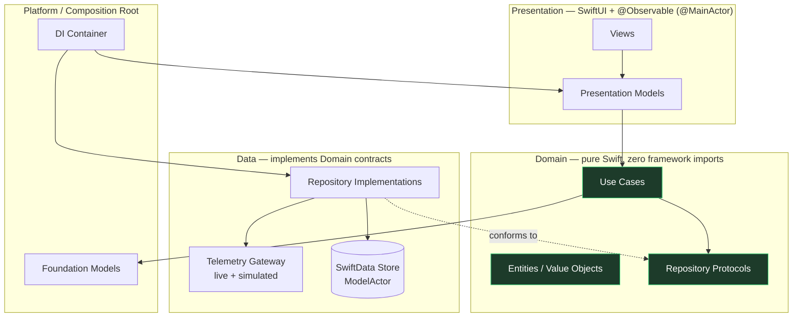

# SignalFlow

> An on-device, offline-first IoT telemetry monitoring platform for iOS 26 — built to demonstrate
> senior-level Swift 6, SwiftUI, and product architecture, not just to "do IoT".

[](#)
[](#)
[](#)
[](#)
[](#)

SignalFlow ingests live telemetry (temperature, humidity, CO₂, GPS, battery, door state,
connectivity) from remote assets — greenhouses, refrigerated trucks, cold-chain shipments,
warehouses, industrial equipment — and turns it into **real-time situational awareness**,
**offline-resilient history**, and **on-device AI insight** using Apple's Foundation Models.

---

## Why this repository exists

This is a **portfolio project**. Its primary product is the *engineering*: the architecture,
the concurrency model, the testing strategy, and the documentation you are reading. The IoT
domain was chosen deliberately because it forces every hard problem a senior iOS engineer should
be able to solve in their sleep:

| Hard problem the domain forces | What it lets the codebase demonstrate |
| --- | --- |
| High-frequency, unbounded event streams | `AsyncSequence`, back-pressure, actor buffering |
| Unreliable connectivity in the field | Offline-first persistence, sync reconciliation, outbox |
| Many devices, parallel work | Structured concurrency, `TaskGroup`, cancellation |
| Shared mutable state under load | Actors, isolation boundaries, `Sendable` |
| Numeric trends humans must interpret | Swift Charts + on-device Foundation Models |
| "Is this number bad?" decisions | Domain rules, anomaly detection, explainability |

## Documentation map

The full design lives in [`/docs`](docs). Read in order, or jump to what you care about:

1. [Product Vision](docs/01-product-vision.md) — what it is, who it's for, business value
2. [Functional Requirements](docs/02-functional-requirements.md) — MVP, roadmap, nice-to-haves
3. [Technical Architecture](docs/03-technical-architecture.md) — Clean Architecture, data flow, dependency rules
4. [Repository Structure](docs/04-repository-structure.md) — SPM modularization, feature & core modules
5. [Domain Design](docs/05-domain-design.md) — entities, aggregates, use cases, repository contracts
6. [Data Layer Design](docs/06-data-layer.md) — remote sources, SwiftData, offline & sync strategy
7. [Concurrency Design](docs/07-concurrency.md) — actors, task groups, cancellation, isolation
8. [Foundation Models Integration](docs/08-foundation-models.md) — on-device AI insight
9. [Testing Strategy](docs/09-testing-strategy.md) — Swift Testing, mocking, concurrency tests
10. [Documentation Strategy](docs/10-documentation-strategy.md) — ADRs, DocC, diagrams
11. [Portfolio Value Analysis](docs/11-portfolio-value.md) — what each part signals to reviewers
12. [Scaffolding](docs/12-scaffolding.md) — the SPM module graph as built, and why each edge exists

Architecture Decision Records: [`/docs/adr`](docs/adr).

## Architecture at a glance



**The one rule that governs everything:** dependencies point *inward*. The Domain layer imports
nothing — not SwiftUI, not SwiftData, not Foundation networking. Everything else depends on the
Domain through protocols, and concrete implementations are injected at the composition root. This
is what makes the system testable, modular, and able to "evolve for years."

## Technology choices

| Concern | Choice | Rationale |
| --- | --- | --- |
| Language | Swift 6, strict concurrency = complete | Compile-time data-race safety is the headline |
| UI | SwiftUI only, no UIKit | Modern, declarative, demonstrates `@Observable` |
| State | Observation framework (`@Observable`) | Replaces `ObservableObject`; finer-grained updates |
| Persistence | SwiftData (`@Model`, `ModelActor`) | First-party, integrates with Observation |
| Charts | Swift Charts | First-party time-series visualization |
| AI | Foundation Models (on-device) | Privacy, offline, no backend, no API keys |
| Testing | Swift Testing (`@Test`, `#expect`) | Modern, parameterized, async-native |
| Modularization | Local Swift Package, many targets | Enforced boundaries without multi-repo overhead |
| 3rd-party deps | **None** | Everything is a deliberate, owned decision |

## Current implementation status

**Phase: architecture skeleton (compile-ready, no business logic yet).**

- ✅ Full design & product documentation suite ([`/docs`](docs)) + ADRs.
- ✅ `SignalFlowKit` Swift Package — 14 targets wiring the Clean Architecture graph
  (Core · Domain · Data · Features · App · Testing). Builds in **Swift 6 mode** with strict
  concurrency, **zero third-party dependencies**. See [Scaffolding](docs/12-scaffolding.md).
- ✅ Architecture boundaries enforced by the dependency graph **and** a CI check
  ([`Scripts/check-boundaries.sh`](Scripts/check-boundaries.sh)).
- ✅ Swift Testing wired with passing smoke tests.
- ⬜️ Domain entities, value objects & ports — *next.*
- ⬜️ Data layer (repositories, SwiftData store, gateways, simulator).
- ⬜️ Feature UIs, composition-root DI & navigation.
- ⬜️ Foundation Models insight integration.
- ⬜️ Xcode iOS app shell (`@main`) wrapping the `SignalFlowApp` composition root.

```bash
swift build                    # compiles all 14 targets (Swift 6, strict concurrency)
swift test                     # Swift Testing smoke suite
./Scripts/check-boundaries.sh  # statically enforces the architecture import rules
```

Each target currently holds a single placeholder namespace so the graph compiles; these are deleted
as real types land. See [Functional Requirements](docs/02-functional-requirements.md) for MVP scope
and roadmap.

## License

MIT (portfolio / educational use).
