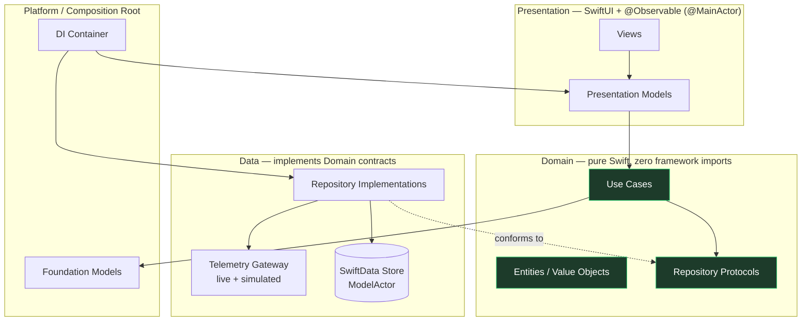

# SignalFlow

> An on-device, offline-first IoT telemetry monitoring platform for iOS 26 — built to demonstrate
> senior-level Swift 6, SwiftUI, and product architecture, not just to "do IoT".

[](#)
[](#)
[](#)
[](#)
[](#)

SignalFlow ingests live telemetry (temperature, humidity, CO₂, GPS, battery, door state,
connectivity) from remote assets — greenhouses, refrigerated trucks, cold-chain shipments,
warehouses, industrial equipment — and turns it into **real-time situational awareness**,
**offline-resilient history**, and **on-device AI insight** using Apple's Foundation Models.

---

## Why this repository exists

This is a **portfolio project**. Its primary product is the *engineering*: the architecture,
the concurrency model, the testing strategy, and the documentation you are reading. The IoT
domain was chosen deliberately because it forces every hard problem a senior iOS engineer should
be able to solve in their sleep:

| Hard problem the domain forces | What it lets the codebase demonstrate |
| --- | --- |
| High-frequency, unbounded event streams | `AsyncSequence`, back-pressure, actor buffering |
| Unreliable connectivity in the field | Offline-first persistence, sync reconciliation, outbox |
| Many devices, parallel work | Structured concurrency, `TaskGroup`, cancellation |
| Shared mutable state under load | Actors, isolation boundaries, `Sendable` |
| Numeric trends humans must interpret | Swift Charts + on-device Foundation Models |
| "Is this number bad?" decisions | Domain rules, anomaly detection, explainability |

## Documentation map

The full design lives in [`/docs`](docs). Read in order, or jump to what you care about:

1. [Product Vision](docs/01-product-vision.md) — what it is, who it's for, business value
2. [Functional Requirements](docs/02-functional-requirements.md) — MVP, roadmap, nice-to-haves
3. [Technical Architecture](docs/03-technical-architecture.md) — Clean Architecture, data flow, dependency rules
4. [Repository Structure](docs/04-repository-structure.md) — SPM modularization, feature & core modules
5. [Domain Design](docs/05-domain-design.md) — entities, aggregates, use cases, repository contracts
6. [Data Layer Design](docs/06-data-layer.md) — remote sources, SwiftData, offline & sync strategy
7. [Concurrency Design](docs/07-concurrency.md) — actors, task groups, cancellation, isolation
8. [Foundation Models Integration](docs/08-foundation-models.md) — on-device AI insight
9. [Testing Strategy](docs/09-testing-strategy.md) — Swift Testing, mocking, concurrency tests
10. [Documentation Strategy](docs/10-documentation-strategy.md) — ADRs, DocC, diagrams
11. [Portfolio Value Analysis](docs/11-portfolio-value.md) — what each part signals to reviewers
12. [Scaffolding](docs/12-scaffolding.md) — the SPM module graph as built, and why each edge exists
13. [Domain Implementation](docs/13-domain-implementation.md) — `DomainKit` as built, and why it's senior-level
14. [Git Workflow & CI](docs/14-git-workflow-and-ci.md) — branching, commits, PR & CI policy
15. [SimulationKit](docs/15-simulation-kit.md) — actor-based deterministic telemetry simulation
16. [DataKit](docs/16-data-kit.md) — adapting simulation streams into the domain repository ports
17. [Feature Layer](docs/17-feature-dashboard-fleet.md) — Dashboard, Fleet & Device Detail (SwiftUI + Charts)
18. [App Shell](docs/18-app-shell.md) — `@main`, composition root, lifecycle & navigation bootstrap

Architecture Decision Records: [`/docs/adr`](docs/adr).

## Architecture at a glance



**The one rule that governs everything:** dependencies point *inward*. The Domain layer imports
nothing — not SwiftUI, not SwiftData, not Foundation networking. Everything else depends on the
Domain through protocols, and concrete implementations are injected at the composition root. This
is what makes the system testable, modular, and able to "evolve for years."

## Technology choices

| Concern | Choice | Rationale |
| --- | --- | --- |
| Language | Swift 6, strict concurrency = complete | Compile-time data-race safety is the headline |
| UI | SwiftUI only, no UIKit | Modern, declarative, demonstrates `@Observable` |
| State | Observation framework (`@Observable`) | Replaces `ObservableObject`; finer-grained updates |
| Persistence | SwiftData (`@Model`, `ModelActor`) | First-party, integrates with Observation |
| Charts | Swift Charts | First-party time-series visualization |
| AI | Foundation Models (on-device) | Privacy, offline, no backend, no API keys |
| Testing | Swift Testing (`@Test`, `#expect`) | Modern, parameterized, async-native |
| Modularization | Local Swift Package, many targets | Enforced boundaries without multi-repo overhead |
| 3rd-party deps | **None** | Everything is a deliberate, owned decision |

## Current implementation status

**Phase: runnable app shell.** The full path — `@main` → composition root → simulated telemetry →
in-memory store → domain repositories → use cases → SwiftUI screens — runs end-to-end. Persistence and
a live gateway are the remaining backend swaps.

- ✅ Full design & product documentation suite ([`/docs`](docs)) + ADRs.
- ✅ `SignalFlowKit` Swift Package — 14 targets wiring the Clean Architecture graph
  (Core · Domain · Data · Features · App · Testing). Builds in **Swift 6 mode** with strict
  concurrency, **zero third-party dependencies**. See [Scaffolding](docs/12-scaffolding.md).
- ✅ Architecture boundaries enforced by the dependency graph **and** a CI check
  ([`Scripts/check-boundaries.sh`](Scripts/check-boundaries.sh)).
- ✅ **`DomainKit` implemented** — type-safe identifiers, validated value objects, entities, pure
  policies, typed errors, repository/insight **ports**, and use cases. Pure Swift + `Foundation`
  only, fully `Sendable`. See [Domain Implementation](docs/13-domain-implementation.md).
- ✅ **`SimulationKit` implemented** — actor-based, deterministic telemetry simulation for a
  10-device fleet (greenhouses, refrigerated trucks, warehouses, environmental stations) exposed as
  cancellation-correct `AsyncStream`s, plus a seeded RNG in `CoreKit`. See
  [SimulationKit](docs/15-simulation-kit.md).
- ✅ **`DataKit` implemented** — an actor-based in-memory store ingests the simulation streams and
  serves the `DomainKit` ports (assets, devices, telemetry history, alerts, events, deterministic
  insights), with leak-free `AsyncStream` ingestion and cancellation. No SimulationKit concept leaks
  past the ports. See [DataKit](docs/16-data-kit.md).
- ✅ **Feature UI implemented** — `FeatureDashboard`, `FeatureFleet`, and `FeatureDeviceDetail` (with
  Swift Charts), built on modern Observation (`@Observable`/`@MainActor`, no Combine), plus a
  domain-aware `DesignSystemKit`. Features see **only DomainKit contracts**. See
  [Feature Layer](docs/17-feature-dashboard-fleet.md).
- ✅ **Runnable app shell** — `@main SignalFlowApp` + `AppContainer` composition root + `RootView`
  navigation. `swift run SignalFlow` launches it; the same files host an Xcode iOS target unchanged.
  See [App Shell](docs/18-app-shell.md).
- ✅ **96 Swift Testing tests** pass (Domain + Simulation + Data + Core + feature models + app shell).
- ⬜️ SwiftData persistence, offline & sync (behind the existing store seam).
- ⬜️ Live `WebSocketGateway` networking (behind the existing gateway seam).
- ⬜️ Foundation Models insight integration (replacing the deterministic placeholder).
- ⬜️ Xcode iOS app target hosting the `@main` shell for on-device/simulator runs.

```bash
swift build                    # compiles all 15 targets (Swift 6, strict concurrency)
swift run SignalFlow           # launches the host build of the app
swift test                     # Swift Testing suite — 96 tests, 22 suites
./Scripts/check-boundaries.sh  # statically enforces the architecture import rules
```

The outer targets still hold a single placeholder namespace so the graph compiles; these are deleted
as real types land. See [Functional Requirements](docs/02-functional-requirements.md) for MVP scope
and roadmap.

## Workflow & CI

Full policy: [docs/14 — Git Workflow & CI](docs/14-git-workflow-and-ci.md).

**Workflow status — bootstrap.** Documentation and the empty package skeleton land directly on
`main` because there is no behavior to break yet. **This ends with the first line of real `DomainKit`
code**, after which every change goes through a `feature/*` branch and a pull request — even with a
single developer.

**Branching policy.** Trunk-based: a permanent `main` plus short-lived, single-purpose topic
branches (`type/short-kebab-summary`).

| Branch | Purpose |
| --- | --- |
| `main` | Stable, always buildable, always green — integration only |
| `feature/*` | Production code, e.g. `feature/domain-kit`, `feature/data-simulation`, `feature/swiftdata-persistence`, `feature/dashboard`, `feature/insights-foundation-models` |
| `docs/*` | Documentation-only changes |
| `chore/*` | Maintenance with no behavior change |
| `ci/*` | CI / tooling changes |

Commits follow [Conventional Commits](https://www.conventionalcommits.org/); PRs use the
[PR template](.github/pull_request_template.md) and must be green before squash-merge.

**CI status.** [GitHub Actions](.github/workflows/ci.yml) runs on **pull requests targeting `main`**
and **pushes to `main`**, executing — in order — `./Scripts/check-boundaries.sh` → `swift build` →
`swift test`. The same three commands run locally, so a green local run means a green CI run.

### Fastlane — intentionally deferred

There is **no Fastlane setup yet, by design.** Fastlane automates *app delivery* (signing, build
numbers, TestFlight/App Store uploads, screenshots, release lanes), but SignalFlow is currently a
**Swift Package** — an architecture/demo layer with no Xcode app target, no bundle ID, and nothing to
sign or ship. Adding it now would be configuration for a pipeline with no destination.

Fastlane will be introduced once SignalFlow has an **Xcode app target**, **app signing**, **build-number
automation**, **TestFlight deployment**, **screenshot automation**, and **release lanes** — at which
point it arrives in a dedicated `ci/add-fastlane` PR. See
[docs/14](docs/14-git-workflow-and-ci.md#fastlane--intentionally-deferred) for the full rationale.

## License

MIT (portfolio / educational use).
