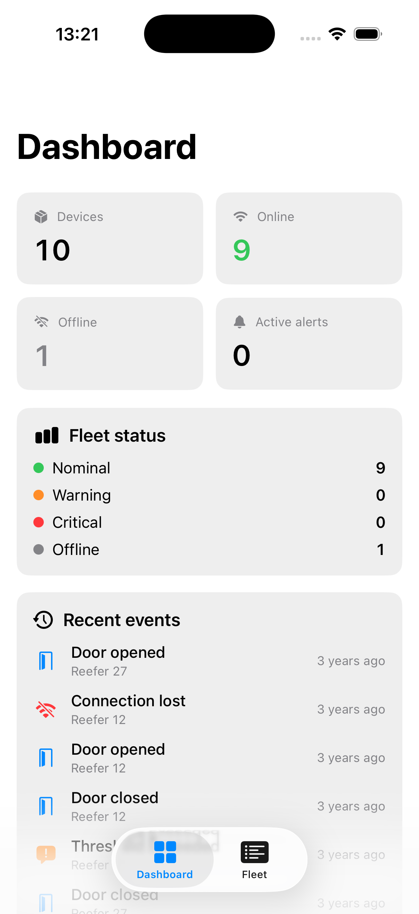
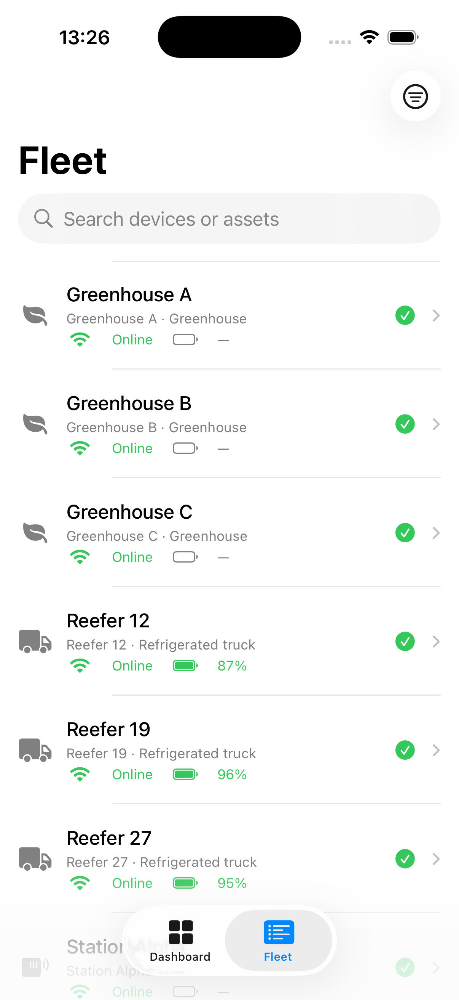
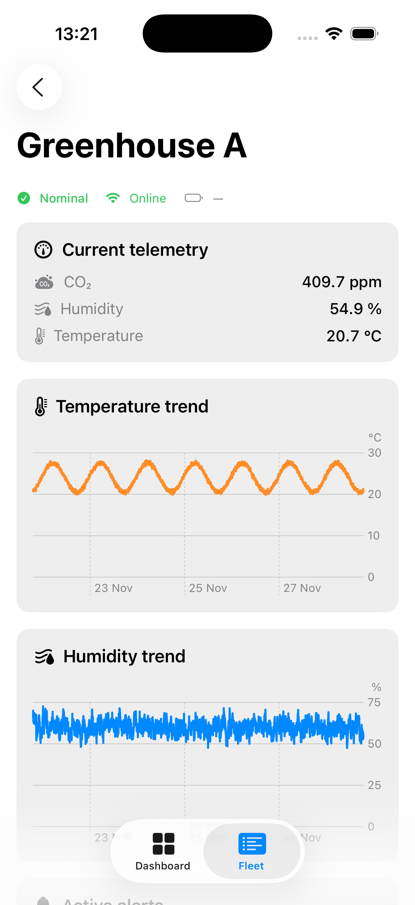
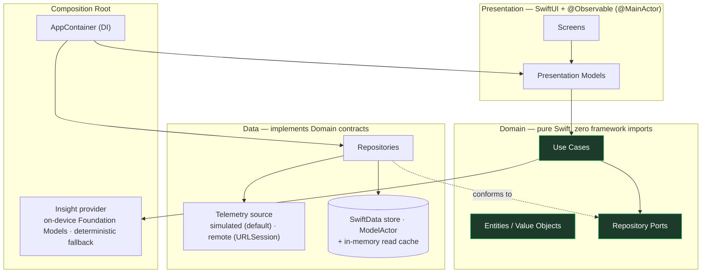
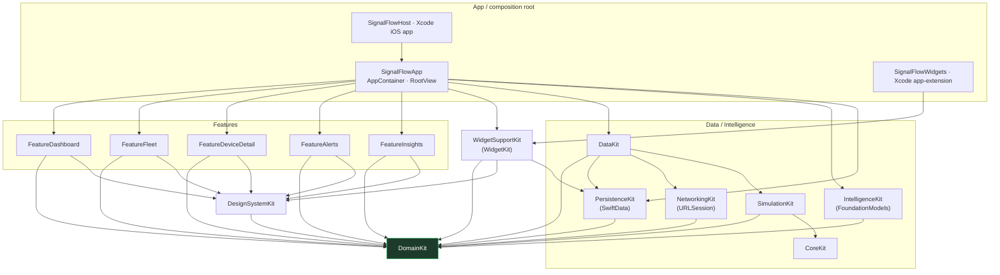

<div align="center">

# SignalFlow

### An offline-first IoT telemetry monitoring app for iOS 26 — built to demonstrate senior-level Swift 6, SwiftUI & app architecture.

[](https://github.com/donatogomez/signal-flow/actions/workflows/ci.yml)
[](#)
[](#)
[](#)
[](#)
[](#how-to-run-the-tests)
[](#)
[](#license)

SignalFlow monitors a fleet of remote IoT devices — greenhouses, refrigerated trucks, warehouses,
environmental stations — turning a firehose of sensor telemetry into **real-time situational
awareness**, **offline-resilient history**, and **on-device insight**.

<br/>


</div>

---

## What it is

SignalFlow ingests live telemetry (temperature, humidity, CO₂, GPS, battery, door state,
connectivity) from many devices at once and presents it as a calm, native monitoring console: a
**Dashboard** of fleet health, a searchable/sortable/filterable **Fleet** list, a **Device
Detail** screen with Swift Charts trends, active alerts, and a recent-events feed, and an **Alerts**
console for triaging and acknowledging active alerts against a resolved history. Two **Home Screen
widgets** mirror fleet status and critical alerts from persisted state.

The IoT domain was chosen deliberately — it forces every hard problem a senior iOS engineer should be
able to solve, and the **real product is the engineering**: the architecture, the Swift 6 concurrency
model, the testing strategy, and the documentation.

| Hard problem the domain forces | What the codebase demonstrates |
| --- | --- |
| High-frequency, unbounded event streams | `AsyncSequence`, back-pressure, actor buffering |
| Unreliable connectivity in the field | Offline-first store, cancellation-safe ingestion |
| Many devices, parallel work | Structured concurrency, `TaskGroup`, cancellation |
| Shared mutable state under load | Actors, isolation boundaries, `Sendable` |
| Numeric trends humans must interpret | Swift Charts + a pluggable insight provider |
| "Is this number bad?" decisions | Pure domain rules, alert lifecycle, explainability |

## Screenshots

| Dashboard | Fleet | Device Detail |
| :---: | :---: | :---: |
|  |  |  |

**Home Screen widgets** — _Fleet Status_ and _Critical Alerts_ (small + medium), rendered from
persisted state and deep-linking back into the app:

| Fleet Status | Critical Alerts |
| :---: | :---: |
| _screenshot coming soon_ | _screenshot coming soon_ |

## What this project demonstrates

Each capability maps to a concrete place in the codebase — the point of the project is that these are
*built and tested*, not asserted.

| Senior competency | Where it lives |
| --- | --- |
| **Swift 6 strict concurrency** — a deliberate actor/isolation model, zero `@unchecked Sendable` | [`SimulationKit`](docs/15-simulation-kit.md), [`DataKit`](docs/16-data-kit.md) |
| **Clean Architecture, enforced** — features physically can't import the data layer | [Architecture](docs/03-technical-architecture.md) · [`check-boundaries.sh`](Scripts/check-boundaries.sh) |
| **Actor-based systems** — device simulators, an in-memory store, an ingestion adapter | [Concurrency](docs/07-concurrency.md) |
| **SwiftData persistence** — a dedicated `ModelActor` off-main, mapping, retention, offline-first restore | [SwiftData Persistence](docs/21-swiftdata-persistence.md) |
| **Networking** — `URLSession` + `async/await`, typed endpoints, DTO mapping, structured errors, retry | [NetworkingKit](docs/22-networking-kit.md) |
| **`AsyncSequence` end-to-end** — cancellation-correct telemetry streams | [`SimulationKit`](docs/15-simulation-kit.md) |
| **Deterministic, reproducible simulation** — seeded RNG + virtual clock | [`SimulationKit`](docs/15-simulation-kit.md) |
| **Domain modeling** — type-safe IDs, validated value objects, pure policies | [`DomainKit`](docs/13-domain-implementation.md) |
| **Modern SwiftUI** — `@Observable`/`@MainActor`, no Combine, Swift Charts | [Feature Layer](docs/17-feature-dashboard-fleet.md) |
| **On-device AI** — Foundation Models + guided generation, grounded facts, deterministic fallback | [Foundation Models Insights](docs/20-foundation-models-insights.md) |
| **Dependency injection** — one composition root owns all concretes | [App Shell](docs/18-app-shell.md) |
| **Testing rigor** — Swift Testing, deterministic concurrency tests, port fakes | [Testing Strategy](docs/09-testing-strategy.md) |
| **Engineering process** — ADRs, enforced CI, trunk-based PR workflow | [Git Workflow & CI](docs/14-git-workflow-and-ci.md) |

## Architecture overview

Layered Clean Architecture. **The one rule that governs everything: dependencies point _inward_.** The
Domain layer imports nothing — not SwiftUI, not SwiftData, not networking. Everything else depends on
the Domain through protocols, and concrete implementations are injected at the composition root.



| Layer | Knows about | Concurrency |
| --- | --- | --- |
| Presentation | Application + Domain | `@MainActor` |
| Application (use cases) | Domain | `nonisolated` / `async` |
| Domain | nothing | `Sendable` value types |
| Data | Domain (implements ports) | actors |
| Composition root | everything (wires it) | `@MainActor` |

Details: [Technical Architecture](docs/03-technical-architecture.md) · [Concurrency Design](docs/07-concurrency.md).

## Module graph

A single local Swift Package (`SignalFlowKit`) with **18 build targets + a test target**. Boundaries
are enforced by the build graph *and* a CI check — a feature target cannot even name the data layer.



The widget surface reads **persisted state only** (`WidgetSupportKit → PersistenceKit`); it has no edge
to `DataKit`, `SimulationKit`, or `NetworkingKit`. The app and the `SignalFlowWidgets` extension share
one SwiftData store via an App Group — see [WidgetKit](docs/24-widgetkit.md).

The thin Xcode app target ([`App/SignalFlow.xcodeproj`](App/SignalFlow.xcodeproj)) hosts the package's
composition root and adds nothing but the bundle, asset catalog, and a synthesized Info.plist.
See [Scaffolding](docs/12-scaffolding.md) and [Xcode iOS Target](docs/19-xcode-ios-target.md).

## Tech stack

| Concern | Choice | Rationale |
| --- | --- | --- |
| Language | Swift 6, strict concurrency = complete | Compile-time data-race safety is the headline |
| UI | SwiftUI only, no UIKit | Modern, declarative, `@Observable`-driven |
| State | Observation (`@Observable`) | Replaces `ObservableObject`; fine-grained updates |
| Charts | Swift Charts | First-party time-series visualization |
| Concurrency | actors, `AsyncSequence`, `TaskGroup` | Structured, cancellation-safe |
| Insight | On-device **Foundation Models** (guided generation) + deterministic fallback | Private, offline, no keys; chosen behind one port |
| Persistence | **SwiftData** (`ModelActor`, off-main) + in-memory read cache | Offline-first, retained; the only SwiftData importer |
| Networking | **`URLSession`** + `async/await`, typed endpoints, DTOs, retry | Production-shaped behind a gateway; deterministic stub for tests/CI |
| Testing | Swift Testing (`@Test`, `#expect`) | Modern, parameterized, async-native |
| Modularization | Local Swift Package, many targets | Enforced boundaries without multi-repo overhead |
| Tooling | SwiftPM + Xcode + GitHub Actions | `swift build`/`swift test` + `xcodebuild` in CI |
| 3rd-party deps | **None** | Everything is a deliberate, owned decision |

## How to run the app

Requires **Xcode 26** (iOS 26 SDK).

```bash
open App/SignalFlow.xcodeproj
```

Select the **SignalFlow** scheme and an iOS Simulator, then Run (⌘R). The app launches into the
Dashboard/Fleet/Alerts/Insights tabs with live simulated telemetry; tap a device to push Device Detail.

From the command line (what CI runs):

```bash
xcodebuild build \
  -project App/SignalFlow.xcodeproj \
  -scheme SignalFlow \
  -sdk iphonesimulator \
  -destination 'generic/platform=iOS Simulator' \
  CODE_SIGNING_ALLOWED=NO
```

Or launch the package's host runner without Xcode:

```bash
swift run SignalFlowHost
```

## How to run the tests

```bash
swift build                    # compiles all 18 build targets (Swift 6, strict concurrency)
swift test                     # Swift Testing suite — 161 tests, 35 suites
./Scripts/check-boundaries.sh  # statically enforces the architecture import rules
```

The same three commands run locally and in CI, so a green local run means a green CI run.

## CI status

[](https://github.com/donatogomez/signal-flow/actions/workflows/ci.yml)

[GitHub Actions](.github/workflows/ci.yml) runs on **pull requests to `main`** and **pushes to
`main`**, with two jobs on a `macos-26` runner:

- **`verify`** — `./Scripts/check-boundaries.sh` → `swift build` → `swift test`.
- **`ios-app`** — `xcodebuild` builds `SignalFlow.app` for the iOS Simulator.

`main` is always green and always buildable; full policy in
[Git Workflow & CI](docs/14-git-workflow-and-ci.md).

## Roadmap

**Built**
- ✅ `DomainKit` — type-safe IDs, validated value objects, pure policies, typed errors, repository/insight **ports**, use cases. Pure Swift + `Foundation`, fully `Sendable`.
- ✅ `SimulationKit` — actor-based, deterministic telemetry simulation for a 10-device fleet, exposed as cancellation-correct `AsyncStream`s (seeded RNG in `CoreKit`).
- ✅ `DataKit` — actor-based in-memory store + ingestion adapter serving the Domain ports; leak-free, cancellation-safe. No simulation concept leaks past the ports.
- ✅ `PersistenceKit` — **SwiftData** persistence via a dedicated `ModelActor` (off-main), with mapping, retention, and restore-on-launch (offline-first). The only module importing SwiftData. See [SwiftData Persistence](docs/21-swiftdata-persistence.md).
- ✅ `NetworkingKit` — production-shaped remote HTTP layer (`URLSession`, typed endpoints, DTO mapping, structured errors, retry) behind a `RemoteGateway` abstraction, with a deterministic stub transport. Integrated into DataKit as a selectable `RemoteDataSource`; the app still defaults to SimulationKit (no backend yet). See [NetworkingKit](docs/22-networking-kit.md).
- ✅ Feature UI — `FeatureDashboard`, `FeatureFleet`, `FeatureDeviceDetail` (Swift Charts), `FeatureAlerts`, `FeatureInsights` on `@Observable`/`@MainActor`; domain-aware `DesignSystemKit`. Features see only Domain contracts.
- ✅ `FeatureAlerts` — an alerts console: fleet-wide active alerts and a resolved history, severity filtering, device/asset context, and **acknowledgement** (which removes an alert from device health). Alerts stay deterministic — raised and cleared by `AlertRule` evaluation, never by AI. See [FeatureAlerts](docs/23-feature-alerts.md).
- ✅ **On-device AI** — `IntelligenceKit` uses Apple **Foundation Models** (guided generation) behind the `InsightsProviding` port, with a deterministic fallback and grounded facts computed in Swift. Safety logic stays deterministic. See [Foundation Models Insights](docs/20-foundation-models-insights.md).
- ✅ App shell + composition root (`AppContainer` / `RootView`) and a thin **Xcode iOS app target**.
- ✅ **WidgetKit** — `SignalFlowWidgets` extension with _Fleet Status_ and _Critical Alerts_ widgets (small + medium). Reads **persisted state only** (`WidgetSupportKit → PersistenceKit`, no DataKit/Simulation/Networking), shares one SwiftData store with the app via an **App Group**, refreshes on a deterministic `TimelineProvider`, and deep-links into Dashboard/Alerts. See [WidgetKit](docs/24-widgetkit.md).
- ✅ Architecture boundaries enforced by a CI check; **161 Swift Testing tests** passing.

**Upcoming**
- ⬜️ Real backend wiring + auth (swap `URLSessionHTTPClient` in at the composition root).
- ⬜️ `FeatureSettings` surface.
- ⬜️ App icon, UI-test/screenshot target & Fastlane release lanes.

See [Functional Requirements](docs/02-functional-requirements.md) for the full scope.

## Documentation

The full design lives in [`/docs`](docs). Read in order, or jump to what you care about:

| # | Document | # | Document |
| --- | --- | --- | --- |
| 01 | [Product Vision](docs/01-product-vision.md) | 11 | [Portfolio Value Analysis](docs/11-portfolio-value.md) |
| 02 | [Functional Requirements](docs/02-functional-requirements.md) | 12 | [Scaffolding](docs/12-scaffolding.md) |
| 03 | [Technical Architecture](docs/03-technical-architecture.md) | 13 | [Domain Implementation](docs/13-domain-implementation.md) |
| 04 | [Repository Structure](docs/04-repository-structure.md) | 14 | [Git Workflow & CI](docs/14-git-workflow-and-ci.md) |
| 05 | [Domain Design](docs/05-domain-design.md) | 15 | [SimulationKit](docs/15-simulation-kit.md) |
| 06 | [Data Layer Design](docs/06-data-layer.md) | 16 | [DataKit](docs/16-data-kit.md) |
| 07 | [Concurrency Design](docs/07-concurrency.md) | 17 | [Feature Layer](docs/17-feature-dashboard-fleet.md) |
| 08 | [Foundation Models](docs/08-foundation-models.md) | 18 | [App Shell](docs/18-app-shell.md) |
| 09 | [Testing Strategy](docs/09-testing-strategy.md) | 19 | [Xcode iOS Target](docs/19-xcode-ios-target.md) |
| 10 | [Documentation Strategy](docs/10-documentation-strategy.md) | 20 | [Foundation Models Insights](docs/20-foundation-models-insights.md) |
| | | 21 | [SwiftData Persistence](docs/21-swiftdata-persistence.md) |
| | | 22 | [NetworkingKit](docs/22-networking-kit.md) |
| | | 23 | [FeatureAlerts](docs/23-feature-alerts.md) |
| | | 24 | [WidgetKit](docs/24-widgetkit.md) |
| | | | [Architecture Decision Records](docs/adr) |

## Portfolio value

> SignalFlow is an iOS 26 IoT monitoring app built to demonstrate senior iOS engineering: Swift 6
> strict concurrency with a deliberate actor/isolation model, Clean Architecture enforced at the
> Swift-Package boundary so the UI literally cannot reach the data layer, an offline-first store with
> cancellation-safe `AsyncSequence` ingestion, modern SwiftUI (`@Observable` + Swift Charts), and a
> Swift Testing suite that tests concurrent code deterministically with injected clocks and seeds. It
> runs end-to-end on a fresh checkout via a built-in telemetry simulator — no backend, no keys — and
> every significant decision is recorded as an ADR with the alternatives I rejected and why.

A full breakdown of what each part signals to reviewers — and the project's honestly-named
limitations — is in [Portfolio Value Analysis](docs/11-portfolio-value.md).

## Project workflow

Trunk-based: a permanent, always-green `main` plus short-lived `feature/*`, `docs/*`, `chore/*`, and
`ci/*` branches. Commits follow [Conventional Commits](https://www.conventionalcommits.org/); every
change merges through a reviewed, CI-green pull request — even as a solo developer. Rationale and
branch strategy: [Git Workflow & CI](docs/14-git-workflow-and-ci.md).

## License

MIT (portfolio / educational use).
