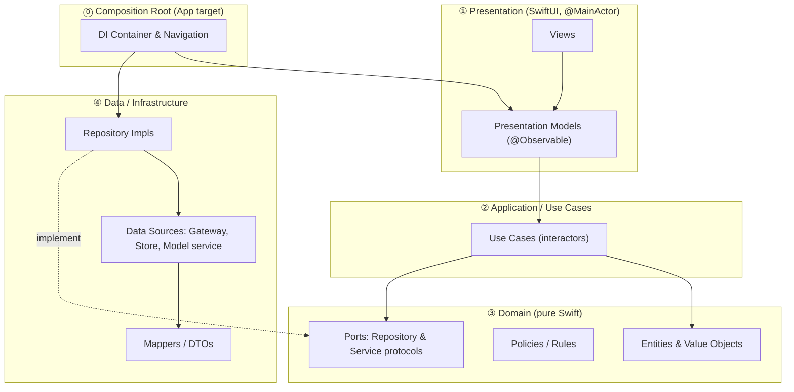
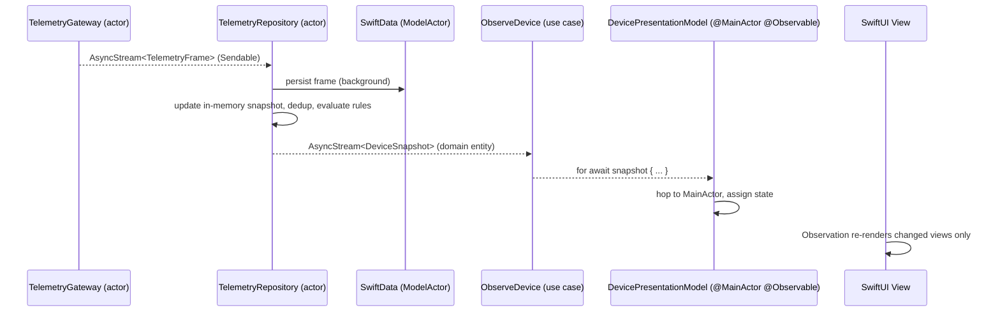
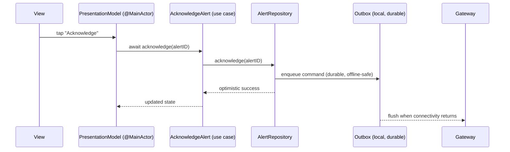

# 3. Technical Architecture

## 3.1 Guiding principles

1. **The Dependency Rule is absolute.** Source-code dependencies point only *inward*, toward the
   Domain. The Domain knows nothing about SwiftUI, SwiftData, networking, or Foundation Models.
2. **Abstractions are owned by the inner layer.** Repository and service *protocols* live in the
   Domain; their *implementations* live in outer layers. This is Dependency Inversion, and it's the
   mechanism that makes the Domain testable in isolation.
3. **Models cross boundaries; frameworks do not.** A SwiftData `@Model` or a network DTO never
   reaches the UI or the Domain. Mappers translate at the boundary.
4. **Concurrency is part of the type system.** `Sendable`, actor isolation, and `@MainActor` are
   design tools, not afterthoughts. See [Concurrency](07-concurrency.md).
5. **Composability over inheritance.** Protocol-oriented, value-type-first. Reference types only
   where identity or isolation genuinely require them (actors, `@Observable` models, `@Model`).

## 3.2 The layers



| # | Layer | Knows about | Never imports | Concurrency |
| --- | --- | --- | --- | --- |
| ③ | **Domain** | Nothing (only Swift stdlib) | SwiftUI, SwiftData, Foundation networking, FoundationModels | `Sendable` value types, no isolation |
| ② | **Application (Use Cases)** | Domain | UI frameworks, concrete data sources | mostly `nonisolated`/`async`, no global actor |
| ① | **Presentation** | Application + Domain | Data implementations | `@MainActor` |
| ④ | **Data** | Domain (to implement ports) | UI / Presentation | actors (`ModelActor`, gateway actors) |
| ⓪ | **Composition Root** | Everything (it wires it together) | — | `@MainActor` app entry |

### Why "Use Cases" are their own layer (and not just methods on a repository)

A use case (a.k.a. interactor) is a single application action — `SummarizeTrend`,
`AcknowledgeAlert`, `EvaluateAlertRules`. Modeling them explicitly:

- gives each user intention a **named, testable unit** with one reason to change;
- keeps Presentation Models thin (they orchestrate use cases, they don't contain business logic);
- composes naturally with structured concurrency (a use case can fan out across repositories with a
  `TaskGroup` while remaining a single call site for the UI);
- makes the [traceability table](02-functional-requirements.md#24-traceability) real — each FR
  points at a use case.

## 3.3 Data flow

### Read path (live telemetry → screen)



Key properties:
- The gateway emits **`Sendable` value frames**; nothing mutable crosses an isolation boundary.
- Persistence happens off the main actor on a `ModelActor`; the UI never blocks on disk.
- The UI observes **domain `DeviceSnapshot` entities**, not SwiftData models — the dependency rule
  holds even on the hot path.
- Back-pressure and coalescing live in the repository actor, so a noisy device can't flood the UI.

### Write path (user action → device + persistence)



User-authored changes are **local-first and optimistic**: they persist immediately and reconcile
later through the outbox (see [Data Layer](06-data-layer.md#offline--outbox)).

## 3.4 Dependency rules (enforced, not aspirational)

Boundaries are enforced **at the build-graph level** by SPM targets, not by convention:

```
DomainKit            → (no internal deps)
ApplicationKit       → DomainKit
DataKit              → DomainKit            (implements DomainKit ports)
IntelligenceKit      → DomainKit            (implements an Insight port)
DesignSystem         → (no internal deps)
Feature*             → DomainKit, ApplicationKit, DesignSystem   (NOT DataKit)
App                  → everything           (composition root only)
```

Because `FeatureFleet` cannot list `DataKit` as a dependency, it is **physically impossible** for a
view to import a repository implementation or a SwiftData model. The compiler enforces Clean
Architecture. This is the single most important structural decision in the project and is recorded
in [ADR-0001](adr/0001-clean-architecture-with-spm-modules.md).

### What flows across each boundary

| Boundary | What crosses (allowed) | What must not cross |
| --- | --- | --- |
| Gateway → Data | `TelemetryFrame` DTO/value | URLSession, sockets |
| Data → Domain | Domain entities (`DeviceSnapshot`, `Alert`) | `@Model` objects, DTOs |
| Domain → Application | Entities, errors, protocols | — |
| Application → Presentation | Domain entities, use-case results | repositories themselves (injected, not leaked) |
| Presentation → View | `@Observable` view state | use-case internals, async streams (PM owns those) |

## 3.5 Cross-cutting concerns

- **Dependency Injection:** a lightweight, compile-time-checked container assembled in the App
  target. No reflection, no third-party DI framework. Protocols + initializer injection; the
  container exists only at the composition root. (See [Repository Structure](04-repository-structure.md#dependency-injection).)
- **Navigation:** value-based `NavigationStack` + a typed `Route` enum per feature, coordinated by a
  `@MainActor` router. Deep links and state restoration become data transformations on `Route`s.
- **Error handling:** typed domain errors (`enum DomainError`) at the Domain boundary; the
  Presentation layer maps them to user-facing, localized messages. No `NSError` leakage upward.
- **Logging/observability:** `OSLog`/`Logger` with per-subsystem categories, injected as a protocol
  so tests can assert on emitted signposts.
- **Time & randomness are dependencies.** A `Clock` and a `RandomNumberGenerator` are injected, never
  called statically — this is what makes the simulator deterministic and concurrency tests
  reproducible.

## 3.6 Why this architecture for *this* product

The combination of *real-time streams + offline persistence + AI + multi-device fan-out* is exactly
the case where ad-hoc MVVM collapses: business rules leak into views, the gateway leaks into the UI,
and tests require a running backend. Clean Architecture with enforced module boundaries is the
proportionate response — it costs some ceremony up front and repays it as the roadmap in
[Functional Requirements §2.2](02-functional-requirements.md#22-future-roadmap-post-mvp) lands
without rewrites. That "designed to evolve for years" property is the thesis of the whole portfolio.
