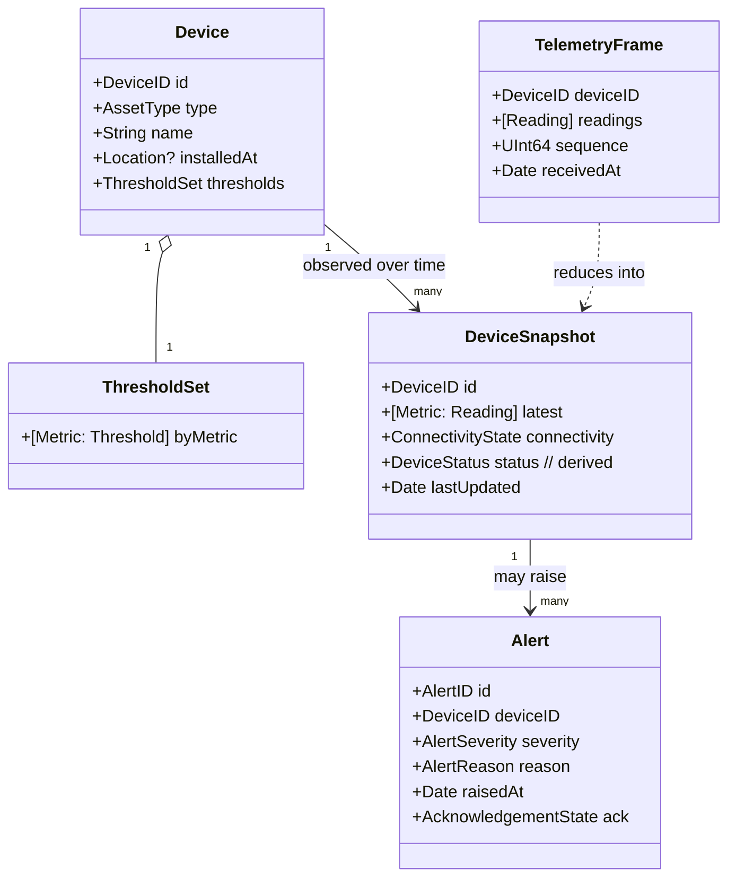

# 5. Domain Design

The Domain (`DomainKit`) is **pure Swift**: value types, protocols, and pure functions, all
`Sendable`, with **zero framework imports**. If a type here imported SwiftData or SwiftUI, the design
would be wrong. Everything in this document compiles without Foundation's networking, without UIKit,
and without a device.

## 5.1 Modeling philosophy

- **Make illegal states unrepresentable.** Use enums and constrained value types so the compiler
  rejects nonsense (a `Reading` can't exist without a `Metric`; a `Temperature` can't be a bare
  `Double` confused with humidity).
- **Value semantics by default.** Entities are `struct`s carrying a stable identity field. We don't
  need reference identity in the Domain — snapshots flow through the system immutably, which is also
  what makes them `Sendable` for free.
- **Units are types, not comments.** Strongly-typed measurements prevent the classic "was that °C or
  °F?" defect class.

## 5.2 Value objects (the vocabulary)

```swift
public struct DeviceID: Hashable, Sendable { public let raw: String }

public enum AssetType: String, Sendable, CaseIterable {
    case greenhouse, refrigeratedTruck, coldChainShipment, warehouse, industrialEquipment, environmentalStation
}

/// A strongly-typed metric kind. New sensor types are added here; the rest of the
/// system is generic over `Metric`, so no schema migration is required (see roadmap nice-to-have).
public enum Metric: Hashable, Sendable {
    case temperature, humidity, co2, batteryLevel, signalStrength
    case doorState, connectivity, location
    case custom(key: String, unit: Unit)     // extensibility without a rewrite
}

public enum Unit: Hashable, Sendable { case celsius, percent, ppm, dBm, boolean, coordinate, raw(String) }

/// A single measured value, unit-aware, never a naked Double.
public enum MeasuredValue: Sendable, Hashable {
    case scalar(Double, Unit)
    case boolean(Bool)                 // door open/closed, connected/disconnected
    case coordinate(latitude: Double, longitude: Double)
}

public struct Reading: Sendable, Hashable {
    public let metric: Metric
    public let value: MeasuredValue
    public let timestamp: Date         // captured at source
}
```

### Why `Metric` is an enum with a `.custom` case

A naive design hardcodes columns (`temperature: Double`, `humidity: Double`). Adding CO₂ then means a
schema migration and changes in five layers. By making readings **generic over a `Metric` value**,
the fleet view, charts, alert engine and persistence all handle "a new kind of number" without code
changes — the [custom-metric roadmap item](02-functional-requirements.md#23-nice-to-have-features)
is *already architecturally true*. This is a deliberate signal of forward-thinking design.

## 5.3 Entities & aggregates



**Aggregate roots and their boundaries:**

| Aggregate root | Owns / guards | Invariants enforced inside |
| --- | --- | --- |
| `Device` | its `ThresholdSet`, identity, asset metadata | thresholds are valid ranges; a device has exactly one threshold set |
| `DeviceSnapshot` | the current reduced state of a device | `status` is *always* derived from readings + thresholds + connectivity, never set externally |
| `Alert` | its severity, reason, acknowledgement lifecycle | ack can only move forward (unacked → acked); severity set at creation |

`TelemetryFrame` is **not** an aggregate — it's an immutable inbound event/value object that is
*reduced* into a `DeviceSnapshot`. Modeling the distinction (event vs. state) is what keeps the
streaming path clean.

### Derived status is a pure function — the heart of the Domain

```swift
public enum DeviceStatus: Sendable { case nominal, warning, critical, offline }

public enum StatusPolicy {
    /// Pure, deterministic, exhaustively testable. No I/O, no clock except injected `now`.
    public static func status(for snapshot: PartialSnapshot,
                              thresholds: ThresholdSet,
                              now: Date,
                              stalenessLimit: Duration) -> DeviceStatus {
        if snapshot.lastUpdated.isStale(now: now, limit: stalenessLimit) { return .offline }
        let breaches = thresholds.evaluate(snapshot.latest)   // pure
        return breaches.worstSeverity ?? .nominal
    }
}
```

Because `StatusPolicy` is a pure function over its inputs (note `now` is *injected*, never
`Date()`), the entire business judgement of "is this device OK?" is unit-tested with table-driven
[parameterized Swift Tests](09-testing-strategy.md) and needs no app, no network, no clock mocking
hacks.

## 5.4 Ports (repository & service contracts)

Ports are protocols **owned by the Domain** and implemented by outer layers (Dependency Inversion).
They are deliberately small, intention-revealing, and `Sendable`.

```swift
public protocol TelemetryRepository: Sendable {
    /// Live, reduced snapshots for a device (offline-first; emits last known immediately).
    func snapshots(for id: DeviceID) -> AsyncStream<DeviceSnapshot>
    /// All devices' current snapshots, kept live.
    func fleet() -> AsyncStream<[DeviceSnapshot]>
    /// Historical readings for charts; paged/ranged.
    func history(for id: DeviceID, metric: Metric, range: DateInterval) async throws -> [Reading]
}

public protocol DeviceRepository: Sendable {
    func devices() async throws -> [Device]
    func updateThresholds(_ thresholds: ThresholdSet, for id: DeviceID) async throws
}

public protocol AlertRepository: Sendable {
    func alerts() -> AsyncStream<[Alert]>
    func acknowledge(_ id: AlertID) async throws        // local-first, syncs via outbox
}

public protocol InsightService: Sendable {
    func summarizeTrend(_ context: TrendContext) async throws -> TrendSummary
    func explainAnomaly(_ context: AnomalyContext) async throws -> AnomalyExplanation
    func fleetDigest(_ context: FleetContext) async throws -> FleetDigest
}
```

Design notes:
- **Streams for live state, `async throws` for one-shot queries/commands.** This pairing models the
  reactive vs. transactional nature of each operation honestly.
- The Domain defines `TrendContext`/`TrendSummary` as plain value types, so `InsightService` is fully
  testable with a fake — the Foundation Models dependency lives entirely in `IntelligenceKit`
  (see [Foundation Models](08-foundation-models.md)).
- Every port is `Sendable` because implementations are actors crossing isolation boundaries.

## 5.5 Use cases (Application layer)

Use cases live in `ApplicationKit`, depend only on `DomainKit`, and orchestrate ports. They contain
*application* logic (sequencing, fan-out, mapping errors) but delegate *business* logic to Domain
policies.

```swift
public struct SummarizeTrend: Sendable {
    let repository: any TelemetryRepository
    let insight: any InsightService

    public func callAsFunction(_ id: DeviceID, metric: Metric, range: DateInterval)
        async throws -> TrendSummary {
        let readings = try await repository.history(for: id, metric: metric, range: range)
        guard readings.count >= 2 else { throw DomainError.insufficientData }
        let stats = TrendStatistics(readings)            // pure Domain computation
        return try await insight.summarizeTrend(.init(metric: metric, stats: stats, samples: readings))
    }
}
```

| Use case | Reads | Writes | Notable concurrency |
| --- | --- | --- | --- |
| `ObserveFleet` | `TelemetryRepository.fleet()` | — | bridges an `AsyncStream` to `@MainActor` |
| `ObserveDevice` | `TelemetryRepository.snapshots` | — | per-screen, cancelled on disappear |
| `LoadTelemetryHistory` | `TelemetryRepository.history` | — | range query, cancellable |
| `EvaluateAlertRules` | snapshot + thresholds | raises `Alert`s | pure policy + persistence |
| `AcknowledgeAlert` | — | `AlertRepository.acknowledge` | optimistic, outbox-backed |
| `SummarizeTrend` | history + `InsightService` | — | combines two ports |
| `GenerateFleetDigest` | fleet + `InsightService` | — | **`TaskGroup`** fan-out across devices |
| `UpdateThresholds` | — | `DeviceRepository` | triggers re-evaluation |

`callAsFunction` lets a use case be invoked like `try await summarizeTrend(id, metric, range)` —
ergonomic at the call site while remaining a discrete, injectable, testable type.

## 5.6 Domain errors

```swift
public enum DomainError: Error, Sendable, Equatable {
    case deviceNotFound(DeviceID)
    case insufficientData
    case insightUnavailable(reason: InsightUnavailableReason)   // model not ready / unsupported device
    case persistenceFailed
    case offline
}
```

Errors are **typed and exhaustive at the Domain boundary**. The Presentation layer maps them to
localized, user-facing copy; raw `NSError`s and gateway-specific errors are translated in `DataKit`
and never surface to the UI. This keeps error handling a first-class, testable part of the design.
