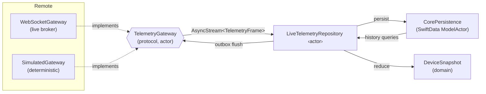
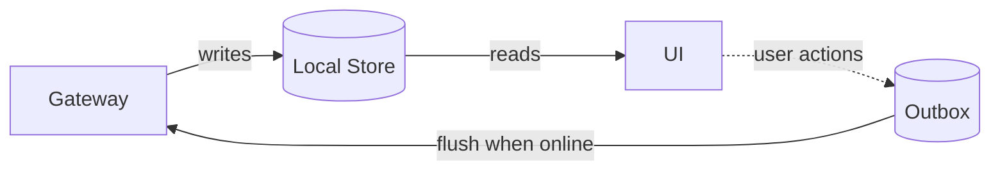

# 6. Data Layer Design

The Data layer (`DataKit` + `CoreTelemetry` + `CorePersistence`) implements the Domain ports. Its
job: get telemetry in, persist it, reduce it to domain entities, and reconcile user-authored changes
back out — all while the Domain and UI remain blissfully unaware of *how*.

## 6.1 Two-source model: gateway (remote) + store (local)



### Remote data sources

A single Domain-facing protocol with two production implementations:

```swift
public protocol TelemetryGateway: Sendable {
    /// Hot stream of inbound frames for all subscribed devices.
    func frames() -> AsyncStream<TelemetryFrame>
    /// Outbound commands (ack, threshold change) — used by the outbox.
    func send(_ command: DeviceCommand) async throws
    func connect() async
    func disconnect() async
}
```

| Implementation | Transport | Purpose |
| --- | --- | --- |
| `WebSocketGateway` | `URLSessionWebSocketTask` + framing | Real broker integration (production path) |
| `SimulatedGateway` | injected `Clock` + seeded RNG | **Zero-backend demo & deterministic tests** |

The `SimulatedGateway` is a **first-class data source**, not a stub. It generates physically
plausible telemetry (diurnal temperature curves, battery decay, occasional door-open events,
connectivity dropouts, and *injectable* anomalies) so the entire app — charts, alerts, AI insight —
is demoable on a fresh checkout with no infrastructure. Because it takes an injected `Clock` and
seed, the same seed always produces the same data, which doubles as a reproducible integration-test
fixture. Rationale in [ADR-0003](adr/0003-simulated-gateway-first-class-datasource.md).

> **Why this matters for a portfolio:** a reviewer clones the repo, hits Run, and immediately sees a
> live, animated, AI-annotated fleet — with no API keys, no backend, no setup. That first-run
> experience is itself an engineering decision.

## 6.2 Local persistence (SwiftData)

`CorePersistence` owns the SwiftData stack. Persisted models are **separate** from Domain entities.

```swift
@Model final class DeviceRecord {            // persistence type — never leaves DataKit
    @Attribute(.unique) var id: String
    var assetTypeRaw: String
    var name: String
    @Relationship(deleteRule: .cascade) var readings: [ReadingRecord]
    var thresholdsBlob: Data                 // encoded ThresholdSet
}

@Model final class ReadingRecord {
    var metricKey: String
    var unitRaw: String
    var doubleValue: Double?
    var boolValue: Bool?
    var lat: Double?; var lon: Double?
    var timestamp: Date
    var sequence: Int                        // monotonic per device, for ordering/dedup
}

@Model final class AlertRecord { /* … */ }
@Model final class OutboxCommandRecord { /* durable pending user actions */ }
```

### Concurrency: a `ModelActor` owns all writes

All persistence runs on a dedicated `ModelActor`, **off the main thread**, so a burst of telemetry
never janks the UI:

```swift
@ModelActor
public actor PersistenceStore {
    func ingest(_ frame: TelemetryFrame) throws { /* insert ReadingRecords, prune by retention */ }
    func history(_ id: DeviceID, _ metric: Metric, _ range: DateInterval) throws -> [Reading] { /* fetch + map */ }
    func enqueue(_ command: DeviceCommand) throws { /* outbox */ }
    func pendingCommands() throws -> [DeviceCommand] { … }
}
```

- The UI reads **domain entities** (mapped from records inside the actor), so SwiftData objects never
  cross an isolation boundary — sidestepping `@Model` non-`Sendable` issues entirely.
- We deliberately **do not** use SwiftUI's `@Query` in views. `@Query` is ergonomic but it couples
  the view directly to SwiftData and breaks the Dependency Rule. Going through a repository keeps
  features testable with fakes and persistence-engine-agnostic. (Trade-off recorded in
  [ADR-0002](adr/0002-swiftdata-local-first.md).)

### Retention & migration

- **Retention policy** (configurable in Settings) prunes `ReadingRecord`s older than N days on
  ingest, keeping the store bounded for high-frequency devices. Downsampled rollups (hourly
  min/max/avg) are retained longer for long-range charts.
- **Schema migration** uses SwiftData's `VersionedSchema` + `SchemaMigrationPlan` from day one, even
  at v1 — a migration plan that starts empty is the cheapest insurance for a "evolve for years"
  project, and demonstrates that the author plans for schema change.

## 6.3 Offline strategy: local-first, store-as-source-of-truth

The cardinal rule: **the UI reads from the local store, never directly from the network.** The
gateway's job is to *feed* the store; the store's job is to *feed* the UI.



Consequences, all of which are the *point*:
- The app is **fully functional offline** — fleet, detail, history, charts all render from local
  data (FR-8).
- "Loading" states are rare; "stale" states are explicit and honest (a snapshot knows its
  `lastUpdated` and the UI shows freshness).
- Reconnection is a non-event for the UI: new frames simply arrive in the store and Observation
  re-renders the affected views.

### Offline & outbox (write path)

User-authored changes — acknowledging an alert, editing a threshold — are **optimistic and durable**:

1. The change is applied locally (store updated, UI reflects it immediately).
2. A `DeviceCommand` is appended to the durable **outbox** (`OutboxCommandRecord`).
3. A background flush task drains the outbox through `gateway.send(_:)` when connectivity is
   available, with retry + exponential backoff.
4. On acknowledgement from the gateway, the command is removed; on permanent failure it surfaces as a
   recoverable, user-visible error.

This is the standard, production-grade **offline write pattern**, and it's exactly what Persona C
(field technician in a dead zone) needs.

## 6.4 Synchronization & reconciliation

Telemetry is **append-only and source-authoritative**, which simplifies sync enormously — we never
have to merge conflicting edits to a reading.

| Concern | Strategy |
| --- | --- |
| **Ordering** | Each frame carries a monotonic `sequence` per device; the store orders and dedups by `(deviceID, sequence)`. Out-of-order arrivals are sorted, not dropped. |
| **Gap detection / backfill** | On reconnect, the repository requests frames since the highest stored `sequence`, backfilling any window missed while offline. |
| **Deduplication** | Idempotent ingest keyed on `(deviceID, sequence)`; replays after reconnect are no-ops. |
| **User-authored data** | Last-write-wins keyed on server-acknowledged timestamps; the outbox guarantees at-least-once delivery, idempotency keys guarantee effectively-once application. |
| **Clock skew** | Source timestamps are trusted for display/ordering; an injected `Clock` provides "now" for staleness so tests stay deterministic. |

### Why append-only telemetry is a deliberate modeling choice

By treating telemetry as an immutable event log (rather than mutable "current value" rows), sync
collapses to "fetch the frames I'm missing." There are no edit conflicts, the audit trail is free and
tamper-evident, and "replay" (a roadmap nice-to-have) becomes trivial. The only genuinely
bidirectional data — user thresholds and acknowledgements — is small, low-frequency, and handled by
the outbox. Picking the data model that makes the hard problem (sync) easy is a senior instinct.

## 6.5 Mapping & boundary enforcement

Every record ↔ entity translation lives in `DataKit` mappers, unit-tested both directions:

```
TelemetryFrame (DTO)  ──map──▶  ReadingRecord (@Model)        // ingest
ReadingRecord (@Model) ──map──▶  Reading (domain)             // read
DeviceRecord (@Model)  ──map──▶  Device (domain)              // read
```

A round-trip property test (`entity → record → entity == entity`) guards against lossy mappings and
is one of the more valuable tests in the suite because mapping bugs are silent and corrupting.
