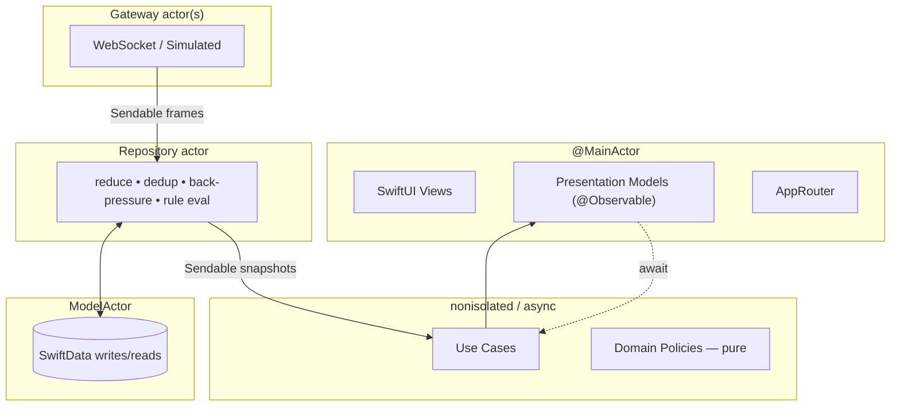

# 7. Concurrency Design

Swift 6 strict concurrency (`-strict-concurrency=complete`) is the headline technical story of
SignalFlow. The goal isn't to *use* actors for show — it's to model a genuinely concurrent system
(many devices, continuous streams, background persistence, on-device inference) such that **data
races are impossible at compile time** and the isolation boundaries map cleanly onto the
architecture.

## 7.1 The isolation map



| Component | Isolation | Why |
| --- | --- | --- |
| Views, Presentation Models, Router | `@MainActor` | UI state must mutate on the main thread; Observation drives re-render |
| Domain entities, policies | `nonisolated` `Sendable` value types | pure, immutable, race-free by construction |
| Use cases | `nonisolated`, `async` | orchestration; no state of their own, hop wherever awaited |
| `TelemetryGateway` impls | `actor` | own the socket/buffer; serialize inbound framing |
| `LiveTelemetryRepository` | `actor` | owns the in-memory snapshot cache, dedup window, rule state |
| `PersistenceStore` | `@ModelActor` `actor` | serializes SwiftData access off-main |
| `OnDeviceInsightService` | `actor` | serializes access to a single `LanguageModelSession` |

The rule of thumb: **mutable shared state ⇒ actor; immutable data ⇒ `Sendable` value type; UI ⇒
`@MainActor`.** Everything else is `nonisolated async` and simply runs wherever it's awaited.

## 7.2 Actors

### Repository actor — the concurrency hub

`LiveTelemetryRepository` is an `actor` because it owns mutable state touched from multiple contexts
(inbound gateway frames, UI subscriptions, history queries, outbox flush). Its responsibilities:

- **Reduce** `TelemetryFrame`s into `DeviceSnapshot`s (event → state).
- **Deduplicate** by `(deviceID, sequence)`.
- **Apply back-pressure / coalescing** so a device emitting at 50 Hz doesn't push 50 UI updates/sec —
  it coalesces to a sensible cadence using a debounced stream from `CoreConcurrency`.
- **Evaluate alert rules** as snapshots change (delegating the actual judgement to pure
  `StatusPolicy`).
- **Fan out** snapshot updates to any number of subscribers via per-subscriber `AsyncStream`s.

Because all of this state lives behind actor isolation, there is **no lock, no queue, no
`@unchecked Sendable`** anywhere in app code.

### Why a single `LanguageModelSession` is behind an actor

Foundation Models sessions are stateful and not safe to hammer concurrently. `OnDeviceInsightService`
is an actor that serializes requests and can apply a simple in-flight/queue policy, so three screens
asking for summaries at once don't corrupt session state or thrash the model. See
[Foundation Models](08-foundation-models.md).

## 7.3 Structured concurrency & task groups

The Domain's fan-out operations use `TaskGroup` for **bounded parallelism with automatic
cancellation propagation**:

```swift
public struct GenerateFleetDigest: Sendable {
    let repository: any TelemetryRepository
    let insight: any InsightService

    public func callAsFunction(_ devices: [DeviceID]) async throws -> FleetDigest {
        // Per-device trend stats computed in parallel; the group cancels all children if the
        // caller's task is cancelled (e.g. the user leaves the screen).
        let perDevice = try await withThrowingTaskGroup(of: DeviceTrend.self) { group in
            for id in devices {
                group.addTask { try await self.trend(for: id) }
            }
            var results: [DeviceTrend] = []
            results.reserveCapacity(devices.count)
            for try await trend in group { results.append(trend) }
            return results
        }
        return try await insight.fleetDigest(.init(trends: perDevice))   // single model call
    }
}
```

Why structured (`withThrowingTaskGroup`) rather than detached tasks:
- **Cancellation propagates automatically** — abandon the parent and every child stops.
- **Errors propagate predictably** — a thrown child error tears down the group.
- **Lifetime is lexically scoped** — no leaked tasks, no manual bookkeeping.

For *bounded* concurrency (don't spawn 500 model calls at once), the group is filled with a sliding
window — add up to N tasks, and only add the next as each completes.

## 7.4 Bridging `AsyncStream` to `@MainActor`

Live screens consume a domain stream via SwiftUI's `.task` modifier, which ties the work to view
lifetime:

```swift
struct DeviceDetailView: View {
    @State private var model: DeviceDetailModel        // @MainActor @Observable

    var body: some View {
        DeviceDetailContent(state: model.state)
            .task(id: model.deviceID) {                 // auto-cancelled on disappear / id change
                await model.observe()                   // for await snapshot in stream { state = … }
            }
    }
}
```

- `.task` **starts on appear and cancels on disappear** — no manual subscription management, no
  retain cycles, no "forgot to unsubscribe" leaks.
- `.task(id:)` **restarts cleanly** when the observed device changes.
- Inside the model, `for await snapshot in stream` runs on the `@MainActor`, so assigning to
  `@Observable` state is automatically main-thread-correct.

## 7.5 Cancellation strategy

Cancellation is **cooperative and structural**, layered top-down:

| Level | Mechanism |
| --- | --- |
| View lifecycle | `.task` / `.task(id:)` cancels its child tree on disappear |
| Use-case fan-out | `TaskGroup` propagates cancellation to all children |
| Long loops | `try Task.checkCancellation()` at loop boundaries in the simulator and flush loops |
| Streams | `AsyncStream` `onTermination` releases gateway/buffer resources |
| Inference | A summary request is cancellable; leaving the Insights screen aborts the model call |

The principle: **every async operation is owned by a scope that can cancel it**, and no operation
ignores cancellation in a way that would waste battery or block teardown. This is exactly the
discipline that separates a toy async demo from a real app.

## 7.6 `Sendable` discipline & escape hatches

- Domain entities are `struct`s that are `Sendable` **by construction** (all stored properties are
  `Sendable`). No annotation gymnastics.
- Ports are `protocol …: Sendable` so their actor implementations satisfy crossing requirements.
- **`@unchecked Sendable` is banned in app/domain code.** The only place it could appear is an
  audited interop shim, and there are none in the design. CI builds with warnings-as-errors under
  complete checking to keep it that way.
- Closures captured by tasks capture only `Sendable` values; the compiler verifies this.

## 7.7 Determinism for tests (and the simulator)

Two dependencies are injected rather than called statically, which is what makes concurrent code
**reproducible**:

- **`Clock`** — `ContinuousClock` in production; a controllable test clock in tests and a virtual
  clock driving the simulator. "Now" and "advance time" become inputs, so staleness, debouncing, and
  trend windows are tested without real waiting.
- **Seeded RNG** — the simulator's randomness is reproducible, so a failing integration scenario can
  be replayed exactly.

Concurrency tests then use Swift Testing's `confirmation` and these injected clocks to assert *"the
stream emitted exactly 3 coalesced snapshots after advancing 5 seconds"* deterministically — no
`sleep`, no flakiness. Details in [Testing Strategy](09-testing-strategy.md).
