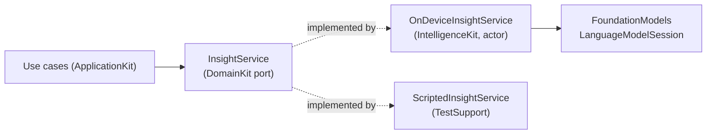

# 8. Foundation Models Integration

SignalFlow uses Apple's **on-device Foundation Models** framework to turn numbers into language: trend
summaries, anomaly explanations, and a fleet digest. The integration is designed to be **useful,
safe, testable, and architecturally contained** — the rest of the app depends on a Domain port
(`InsightService`), not on the framework.

## 8.1 Why on-device (and why it's a product decision)

| Property | Consequence for SignalFlow |
| --- | --- |
| Runs locally, no server | Zero inference cost, no API keys, **runs on a fresh checkout** |
| No data egress | Sensor data and GPS never leave the device for AI — a real selling point for regulated logistics/industrial customers |
| Works offline | Insight is available exactly when field operators (Persona C) need it most |
| Private by default | Aligns with Apple platform expectations; no privacy policy headaches |

This directly supports the [business value](01-product-vision.md#12-business-value) argument: AI that
costs nothing per use, leaks nothing, and works in a dead zone.

## 8.2 Architectural containment



- `InsightService` (the port) is defined in `DomainKit` using **plain value types only**
  (`TrendContext`, `TrendSummary`, …). The Domain never imports `FoundationModels`.
- `OnDeviceInsightService` in `IntelligenceKit` is the **only** code that imports the framework.
- Tests and previews inject `ScriptedInsightService`, so the entire app is testable and previewable
  **without** AI hardware, model availability, or nondeterministic output.

This containment is the difference between "I called an LLM API in a view" and "I integrated a model
behind a stable, testable boundary." It's the senior signal.

## 8.3 Practical use cases

### a) Trend summary (FR-12)
Input: a metric's readings over a range + computed `TrendStatistics` (slope, min/max, breach
intervals — all from pure Domain code). Output: one tight paragraph.
> *"Internal temperature held between 2.1–3.4 °C for most of the last 24 h, but rose steadily after
> 02:00, crossing the 4 °C limit twice between 03:10 and 03:40 while the unit was stationary."*

### b) Anomaly explanation (FR-13)
Attached to any flagged event. The model receives the breach context and the surrounding readings and
produces a plain-language *candidate* explanation, explicitly framed as a hypothesis.
> *"Likely cause: a door-open event at 03:08 coincides with the temperature rise. Recommend checking
> whether the cargo door sealed properly."*

### c) Fleet digest (FR-14)
The `GenerateFleetDigest` use case fans out per-device trends with a `TaskGroup`
([Concurrency §7.3](07-concurrency.md#73-structured-concurrency--task-groups)), then makes **one**
model call to produce a prioritized morning briefing for Persona A.

### d) Conversational query (roadmap v1.2) — tool calling
The model is given **tools** that call back into repositories, so it answers grounded questions over
real data rather than hallucinating:
> User: *"Which trucks risk a cold-chain breach in the next two hours?"* → the model calls a
> `projectedBreaches(horizon:)` tool backed by Domain trend extrapolation and answers from the result.

## 8.4 Structured, safe output with guided generation

We never parse free-form model text into app state. Outputs are constrained with **`@Generable`
guided generation**, so the model returns typed, validated structures:

```swift
@Generable
struct TrendSummaryDraft {
    @Guide(description: "2–3 sentence plain-language summary, no numbers invented")
    let narrative: String

    @Guide(description: "Overall direction") let direction: TrendDirection   // @Generable enum
    @Guide(description: "0.0–1.0 confidence") let confidence: Double
    @Guide(description: "At most 2 short, concrete suggested actions") let recommendations: [String]
}
```

Benefits:
- **No fragile string parsing** — the framework guarantees the shape.
- **Validation is structural** — out-of-range/invalid fields are rejected before reaching the Domain.
- The Domain's `TrendSummary` is mapped from the draft inside `IntelligenceKit`, keeping the
  `@Generable` type (a framework concern) out of `DomainKit`.

## 8.5 Grounding & anti-hallucination strategy

LLMs invent numbers; telemetry must not be invented. The mitigations are architectural:

1. **Compute facts in Swift, narrate them in the model.** All statistics (slopes, min/max, breach
   counts, durations) are computed by **pure Domain code** and passed *in*. The model's job is
   phrasing, not arithmetic.
2. **Prompts instruct "do not invent values; only describe the provided data."**
3. **Confidence is surfaced, not hidden.** Low-confidence summaries are labeled in the UI.
4. **Explanations are framed as hypotheses** ("likely cause"), never asserted facts — appropriate for
   a system whose users make real operational decisions.
5. **Deterministic fallback.** If the model is unavailable (`SystemLanguageModel.availability`),
   `OnDeviceInsightService` returns a **template-based summary** built from the same statistics, so
   the feature degrades gracefully instead of disappearing.

## 8.6 Availability, lifecycle & performance

- **Availability check.** On launch and before use we check model availability; the Insights feature
  adapts (full AI / template fallback) rather than crashing on unsupported devices. The port exposes
  `DomainError.insightUnavailable(reason:)` for honest UI states.
- **Session reuse behind an actor.** A `LanguageModelSession` is stateful; `OnDeviceInsightService`
  is an actor that owns one session and serializes access, preventing concurrent-use corruption
  ([Concurrency §7.2](07-concurrency.md#72-actors)).
- **Cancellation.** Inference is cancellable; leaving the Insights screen aborts the request via the
  structured `.task` scope, saving battery.
- **Streaming UX (optional).** Where supported, partial generation can stream into the UI so a summary
  appears progressively rather than after a pause.

## 8.7 Why this is the right amount of AI

The temptation in a portfolio is to bolt AI onto everything. SignalFlow uses it **only where language
genuinely beats numbers**: summarizing multi-hour trends, hypothesizing causes, and triaging a fleet.
Status, alerting, and thresholds remain **deterministic Domain logic** — you don't want an LLM
deciding whether a truck is in breach. Knowing *where not to use AI* (safety-critical, deterministic
judgements) is as strong a signal as the integration itself.
