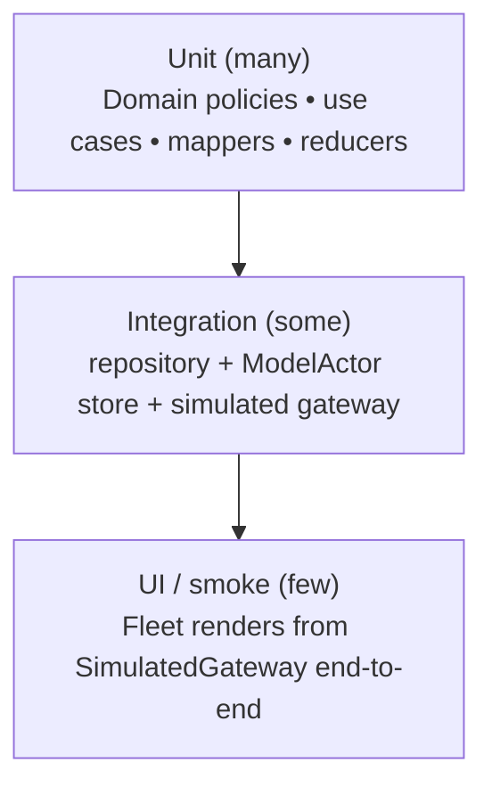

# 9. Testing Strategy

Testing is built **into the architecture**, not bolted on. The whole point of the Dependency Rule,
ports, and injected `Clock`/RNG is that the interesting logic can be tested with no device, no
network, no real model, and no flakiness. The suite uses **Swift Testing** exclusively.

## 9.1 The testing pyramid for SignalFlow



Most value sits in the wide base: **pure Domain logic and use cases**, which are fast, deterministic,
and exhaustive. Higher tiers verify the wiring.

## 9.2 Swift Testing features used

```swift
import Testing

@Suite("Status policy")
struct StatusPolicyTests {

    // Table-driven coverage of the core business judgement.
    @Test("derives status from readings, thresholds and staleness", arguments: [
        StatusCase(temp: 3.0, ageSeconds: 1,   expected: .nominal),
        StatusCase(temp: 4.5, ageSeconds: 1,   expected: .critical),
        StatusCase(temp: 3.0, ageSeconds: 600, expected: .offline),
    ])
    func status(_ c: StatusCase) {
        let result = StatusPolicy.status(for: c.snapshot, thresholds: c.thresholds,
                                         now: c.now, stalenessLimit: .seconds(120))
        #expect(result == c.expected)
    }

    @Test func acknowledgementCannotRegress() throws {
        var alert = try #require(Alert.unacknowledged(.sample))
        alert.acknowledge()
        #expect(throws: DomainError.self) { try alert.acknowledge() }   // forward-only invariant
    }
}
```

| Feature | Where it's used |
| --- | --- |
| `@Test` / `@Suite` | everywhere; suites group by behavior |
| **Parameterized `arguments:`** | table-driven Domain policy & mapper coverage (replaces dozens of copy-paste tests) |
| `#expect` / `#require` | soft vs. hard assertions; `#require` to unwrap-or-fail |
| `#expect(throws:)` | typed `DomainError` assertions |
| **`confirmation`** | async/stream event-count assertions (see §9.5) |
| **Traits** (`.tags`, `.timeLimit`, `.serialized`) | tag concurrency tests, bound runtime, serialize the model-session suite |
| `.disabled(if:)` | gate the (few) tests that need real Foundation Models availability |

## 9.3 Mocking approach — protocols + `TestSupport`

There is **no mocking framework** (it would violate "no dependencies" and isn't needed). Because every
collaborator is a Domain port, test doubles are ordinary types in the `TestSupport` module:

```swift
public actor FakeTelemetryRepository: TelemetryRepository {
    private var scriptedFleet: [DeviceSnapshot]
    private var scriptedHistory: [Reading]
    public func fleet() -> AsyncStream<[DeviceSnapshot]> { /* replay scriptedFleet */ }
    public func history(for id: DeviceID, metric: Metric, range: DateInterval) async throws -> [Reading] {
        scriptedHistory
    }
}

public struct ScriptedInsightService: InsightService {
    public func summarizeTrend(_ c: TrendContext) async throws -> TrendSummary { .fixture }
}
```

- **Fakes/stubs over mocks**: we assert on *outcomes and recorded calls*, not on framework-recorded
  expectations. Simpler, less brittle.
- **Data builders** (`DeviceBuilder`, `ReadingBuilder`) construct fixtures fluently, keeping tests
  readable.
- `TestSupport` is a real module, reused by every test target and by SwiftUI previews — the same
  fakes power `AppContainer.preview()`.

## 9.4 What each layer tests

| Layer | Representative tests | Doubles used |
| --- | --- | --- |
| **Domain** | `StatusPolicy`, threshold breach detection, `TrendStatistics`, alert invariants | none — pure functions |
| **Application (use cases)** | `SummarizeTrend` (insufficient-data error), `GenerateFleetDigest` (fan-out, cancellation), `AcknowledgeAlert` (optimistic + outbox) | `FakeTelemetryRepository`, `ScriptedInsightService` |
| **Data** | mapper round-trips (`entity→record→entity`), dedup by sequence, retention pruning, **outbox flush + retry** | `SimulatedGateway`, in-memory SwiftData store |
| **Intelligence** | draft→domain mapping, availability fallback to template, grounding (no invented numbers in fixtures) | real framework gated/`.disabled`, otherwise fakes |
| **Presentation** | presentation-model state transitions given scripted streams; error→message mapping | fake use cases |

### High-value targeted tests
- **Mapper round-trip property test** — silent mapping corruption is the scariest data bug.
- **Sync reconciliation** — out-of-order frames, gap backfill, duplicate replay are all unit-tested
  against the store with a deterministic sequence.
- **Outbox** — enqueue while offline, flush on reconnect, idempotent re-delivery.

## 9.5 Concurrency & integration testing (the hard part, made deterministic)

This is where injected `Clock` + seeded RNG pay off. No `Task.sleep`, no wall-clock waits, no
flakiness.

```swift
@Test(.timeLimit(.minutes(1)), .tags(.concurrency))
func coalescesBurstIntoSingleSnapshot() async {
    let clock = TestClock()
    let gateway = SimulatedGateway(clock: clock, seed: 42)
    let repo = LiveTelemetryRepository(gateway: gateway, clock: clock, store: .inMemory())

    await confirmation(expectedCount: 1) { gotSnapshot in
        let task = Task {
            for await _ in repo.snapshots(for: .truck12) { gotSnapshot() ; break }
        }
        gateway.emitBurst(50, for: .truck12)     // 50 frames…
        await clock.advance(by: .milliseconds(250))   // …coalesced within the debounce window
        await task.value
    }
}
```

Techniques:
- **`TestClock`** turns time into an input — advance it explicitly to drive debounce windows,
  staleness transitions, and retry backoff.
- **`confirmation(expectedCount:)`** asserts an async event happened *exactly N times* — perfect for
  "did the stream emit the right number of coalesced updates?".
- **Deterministic simulator** (seed `42`) reproduces an entire scenario, including injected anomalies,
  byte-for-byte.
- **Integration tier**: wire the *real* repository + *real* `ModelActor` store + *simulated* gateway
  and assert end-to-end that an injected excursion produces a persisted `Alert` and a derived
  `critical` status — all in-memory, in milliseconds.

## 9.6 Coverage philosophy

We optimize for **confidence per test**, not a coverage percentage:
- **Domain policies & mappers: near-exhaustive** (cheap, deterministic, high-stakes).
- **Use cases: behavior-complete** (happy path + each error + cancellation).
- **Data sync/outbox: scenario-complete** (the failure modes that corrupt or lose data).
- **Presentation: state-machine-complete**, not pixel snapshots.
- **UI: a thin smoke layer** proving the composition root assembles and the simulator drives a live
  screen.

The architecture is what makes this affordable: because business logic is pure and isolated, the
expensive, flaky kinds of tests (full UI, real network, real model) are needed only as a thin
top layer.
