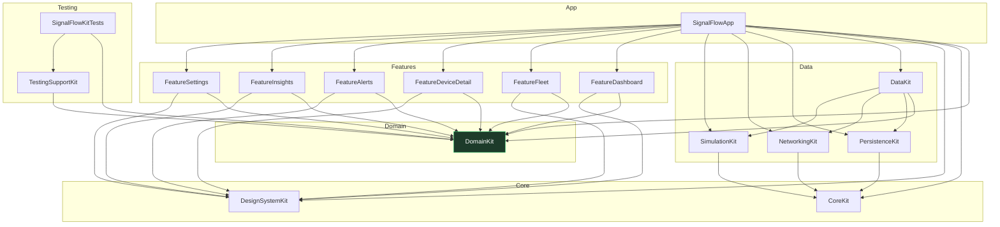

# 12. Scaffolding — the module graph

This document describes the **compile-ready skeleton** committed in this step: the `SignalFlowKit`
Swift Package, its targets, and exactly why each dependency edge exists. There is no business logic
yet — every target ships a single placeholder namespace so the graph builds and the architecture is
established before any feature is written.

- **Tools:** `swift-tools-version: 6.2`, Swift 6 language mode on every target (complete strict
  concurrency is the default in that mode).
- **Platforms:** iOS 26 (product target) + macOS 26 (so `swift build` / `swift test` run from the CLI
  and in CI without a simulator).
- **Dependencies:** none (no third-party packages).

## 12.1 The graph



## 12.2 Why each dependency exists

| Target | Depends on | Rationale |
| --- | --- | --- |
| `CoreKit` | — | Feature-agnostic foundations (clock, concurrency helpers). The lowest leaf; depends on nothing so anything may depend on it. |
| `DesignSystemKit` | — | Visual vocabulary. Kept independent so it carries no business or data concerns and can be previewed alone. |
| `DomainKit` | — | The pure business core. **Must depend on nothing** — that purity is what makes it testable in isolation and is the linchpin of the whole design. |
| `NetworkingKit` | `CoreKit` | Live transport; uses shared utilities, produces raw transport DTOs (no domain concepts). |
| `PersistenceKit` | `CoreKit` | Local SwiftData store; uses shared utilities. Records stay internal. |
| `SimulationKit` | `CoreKit` | Deterministic telemetry generator; uses the shared injectable clock. |
| `DataKit` | `DomainKit`, `PersistenceKit`, `NetworkingKit`, `SimulationKit` | The aggregator that **implements DomainKit's ports** on top of the three data sources and owns mapping/sync/outbox. |
| `Feature*` (×6) | `DomainKit`, `DesignSystemKit` | Vertical UI slices. They consume domain entities/ports and design components only. **They deliberately cannot name a data module** — repositories arrive via injected protocols. |
| `SignalFlowApp` | everything above | The composition root: the *only* target that knows concrete types, binds data implementations to domain ports, and assembles features. |
| `TestingSupportKit` | `DomainKit` | Shared test doubles/fixtures (empty for now); typed against domain ports. |
| `SignalFlowKitTests` | `DomainKit`, `TestingSupportKit` | Smoke tests proving the test stack and `TestingSupportKit` link and run. |

The single most important edges are the **absences**: no `Feature*` target lists `DataKit`,
`PersistenceKit`, or `NetworkingKit`, and `DomainKit` lists nothing at all.

## 12.3 How the boundaries are actually enforced

Enforcement is two layers, because SwiftPM alone has a sharp edge worth being honest about:

1. **The dependency graph (primary).** SwiftPM scopes each target's compile invocation to its
   *declared* dependencies. On a clean or isolated build, an undeclared `import DataKit` inside a
   feature fails with `error: no such module 'DataKit'`. The declared graph above *is* the
   architecture.

2. **A static boundary check (the gap-closer).** On a **full** `swift build`, SwiftPM emits every
   module into one shared search directory, so an *accidental* undeclared import can compile locally
   even though the dependency wasn't declared. To close that gap,
   [`Scripts/check-boundaries.sh`](../Scripts/check-boundaries.sh) statically rejects forbidden
   imports (any `Feature*` importing a data module; `DomainKit` importing anything first-party) and
   runs in CI. It exits non-zero on the first violation.

> This two-layer approach is deliberate: claiming "the compiler makes it physically impossible" would
> be an overstatement given SwiftPM's shared module cache. The honest, stronger position is *the
> dependency graph defines the boundaries and a CI check guarantees they hold on every build.*

## 12.4 What is intentionally **not** here yet

Per the scaffolding scope, the skeleton contains no:
- domain entities, value objects, or ports;
- repositories, stores, gateways, or mappers;
- screens, views, or presentation models;
- DI wiring or navigation;
- AI/Foundation Models code.

Each target holds exactly one placeholder `enum <Target>` with a `moduleName` marker, present only so
the target has a source file and the graph compiles. These markers are deleted as real types land.

## 12.5 Verifying the skeleton

```bash
swift build                 # compiles all 14 targets in Swift 6 mode
swift test                  # runs the scaffolding smoke tests (Swift Testing)
./Scripts/check-boundaries.sh   # statically verifies the architecture boundaries
```

The actual iOS app shell (an Xcode app target with `@main App`) is a thin wrapper that links the
`SignalFlowApp` product and hands off to its composition root; it is added when UI work begins.
