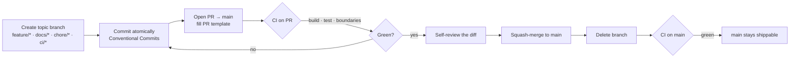

# 14. Git Workflow & CI

SignalFlow is a **public portfolio repository**. Its commit history, branch names, and pull requests
are part of the deliverable — a reviewer reads them the way they'd read a teammate's. This document
defines the workflow the project follows once real production code begins, and why a solo developer
still benefits from it.

> **TL;DR:** `main` is always green and always shippable. Bootstrap (docs + empty skeleton) lands
> directly on `main`; **everything from `DomainKit` onward goes through a feature branch and a pull
> request** — even though there's only one developer.

## 14.1 Why `main` must always remain stable

`main` is the project's résumé. The promise it makes is simple and absolute: **any commit on `main`
builds, passes tests, and respects the architecture boundaries.** Concretely, for every commit on
`main`:

```bash
swift build && swift test && ./Scripts/check-boundaries.sh   # must all pass
```

Why this matters here specifically:
- A reviewer may clone *any* commit. A broken `main` reads as "doesn't finish things."
- A green `main` lets `git bisect` and "what changed when" actually work.
- It forces the discipline of integrating only complete, verified units of work — the same property
  that lets a real team move fast without breaking each other.

`main` is therefore treated as a **protected, integration-only branch**: changes arrive via reviewed
pull requests, never via half-finished direct pushes.

## 14.2 Why direct commits to `main` are acceptable *only* during bootstrap

The **bootstrap phase** is the narrow window where the repository contains only:
- documentation (`/docs`, `README`, ADRs), and
- the **compile-ready package skeleton** with placeholder namespaces and no business logic.

During bootstrap there is nothing to break: there are no entities, no repositories, no UI, no
behavior a PR could meaningfully review. Branch-and-PR ceremony at that stage would be theatre — it
would generate empty review history without protecting anything. So bootstrap lands on `main`
directly, and this is stated openly rather than hidden.

**Bootstrap ends — and the branch/PR workflow begins — the moment real code is introduced.** The
first such change is `DomainKit`'s entities and ports. From that commit onward, direct pushes to
`main` stop.

## 14.3 When to start using feature branches

| Change | Bootstrap (now) | After bootstrap |
| --- | --- | --- |
| Docs, README, ADRs | direct to `main` ✅ | `docs/*` branch + PR |
| Package skeleton / placeholders | direct to `main` ✅ | branch + PR |
| **Any production Swift logic** | n/a | **always** `feature/*` branch + PR |
| CI / tooling / scripts | direct to `main` ✅ | `ci/*` or `chore/*` branch + PR |

The trigger is unambiguous: **the first line of real `DomainKit` code is the last direct commit to
`main`.**

## 14.4 Branch strategy & naming convention

A single long-lived branch (`main`) plus short-lived, single-purpose topic branches. No `develop`
branch — trunk-based development keeps history honest and is the right scale for one developer.

| Branch | Purpose | Lifetime |
| --- | --- | --- |
| `main` | Stable, always buildable, always green. Integration only. | permanent |
| `feature/domain-kit` | Domain entities, value objects, policies, ports | short-lived |
| `feature/data-simulation` | `SimulationKit` deterministic telemetry source | short-lived |
| `feature/swiftdata-persistence` | `PersistenceKit` store, models, migration | short-lived |
| `feature/dashboard` | `FeatureDashboard` UI slice | short-lived |
| `feature/insights-foundation-models` | On-device AI insight integration | short-lived |
| `docs/*` | Documentation-only changes (e.g. `docs/adr-cloud-sync`) | short-lived |
| `chore/*` | Maintenance: deps, formatting, refactors with no behavior change | short-lived |
| `ci/*` | CI/workflow/tooling changes (e.g. `ci/add-docc-build`) | short-lived |

**Naming rules:**
- `type/short-kebab-summary` — lowercase, hyphenated, scoped to one concern.
- Allowed `type` prefixes: `feature`, `docs`, `chore`, `ci` (extendable later with `fix`, `release`).
- One branch = one PR = one coherent unit of work. Branches are deleted after merge.

## 14.5 Commit message style

[Conventional Commits](https://www.conventionalcommits.org/) — a small, widely recognized convention
that makes history scannable and enables automated changelogs later.

```
<type>(<optional scope>): <imperative, lower-case summary>

<optional body: what & why, not how>

<optional footer: breaking changes, issue refs>
```

- **Types:** `feat`, `fix`, `docs`, `chore`, `ci`, `test`, `refactor`, `perf`, `build`.
- **Subject:** imperative mood ("add fleet status policy", not "added"/"adds"), ≤ ~72 chars, no
  trailing period.
- **Atomic commits:** each commit builds and is one logical change.

Examples:
```
feat(domain): add Metric value type with custom-key extensibility
test(domain): cover StatusPolicy staleness transitions
docs(adr): record on-device Foundation Models decision (ADR-0004)
ci: run check-boundaries.sh before build on PRs
chore: apply SwiftFormat to DomainKit
```

## 14.6 Pull Request expectations (even solo)

Every post-bootstrap change merges through a PR into `main`. A solo PR is not bureaucracy — it is:
- a **forcing function** for self-review (reading your own diff catches real bugs),
- the **CI gate** (`build` + `test` + boundary check must pass before merge),
- a **narrative artifact** a reviewer can read to understand *how you think*, and
- a clean, revertible unit in history.

**Each PR is expected to:**
1. Be **small and single-purpose** — one feature/concern, reviewable in one sitting.
2. **Pass CI** — green `swift build`, `swift test`, and `./Scripts/check-boundaries.sh`.
3. Use the [PR template](../.github/pull_request_template.md): summary, rationale, test evidence,
   linked ADR(s), and a self-review checklist.
4. **Keep `main` green** — never merge a red or WIP branch.
5. Be **squash-merged** with a Conventional-Commit title, then the branch is deleted.

### What a reviewer should expect to see in a PR
- A **clear title and summary** explaining *what* and *why*.
- A **focused diff** — no unrelated drive-by changes.
- **Tests for new behavior** (Swift Testing), and a note on what was verified.
- **Architecture respected** — no new cross-boundary imports (the boundary check proves it).
- A reference to the **ADR** that governs the change, or a new ADR when a significant decision is
  made (see [Documentation Strategy §10.2](10-documentation-strategy.md#102-architecture-decision-records-adrs)).
- An honest **trade-offs / follow-ups** note where relevant.

## 14.7 The end-to-end loop



## 14.8 Why this workflow demonstrates engineering maturity

For a public portfolio, *how* the code arrives is as legible as the code itself:
- **Discipline without a team.** Following PR hygiene solo signals that the habits are intrinsic, not
  externally imposed — exactly what hiring managers screen for.
- **Communication.** Well-written PRs and commits are the day-to-day artifacts of senior work; this
  repo shows them, not just asserts them.
- **Honest pragmatism.** Allowing direct-to-`main` *only* during bootstrap, and saying so, shows
  judgment about when process adds value versus when it's ceremony — a senior trait.
- **Verifiability.** A reviewer can trust `main` because CI enforces the contract on every commit;
  the green badge isn't decoration.

---

## CI strategy

GitHub Actions is the single gate. The pipeline is intentionally minimal and fast, and it enforces
exactly the `main` contract from §14.1.

**Triggers**
- **Pull requests targeting `main`** — nothing merges without a green run.
- **Pushes to `main`** — guarantees the integration branch is verified after every merge.

**Steps (in order)**
1. `./Scripts/check-boundaries.sh` — fail fast on architecture violations before spending build time
   (closes SwiftPM's full-build module-cache gap; see
   [Scaffolding §12.3](12-scaffolding.md#123-how-the-boundaries-are-actually-enforced)).
2. `swift build` — all targets in Swift 6 mode with complete strict concurrency.
3. `swift test` — the Swift Testing suite.

Workflow: [`.github/workflows/ci.yml`](../.github/workflows/ci.yml). The same three commands run
locally, so "works on my machine" and "passes CI" are the same statement.

**Deliberately deferred (future CI):** DocC build & link-check, SwiftFormat/lint gate, code-coverage
reporting, and — once there's an app target — UI tests and the Fastlane lanes described below. Each
is added in its own `ci/*` PR when the corresponding code exists, not speculatively.

---

## Fastlane — intentionally deferred

**SignalFlow does not use [Fastlane](https://fastlane.tools) yet, and that is a deliberate decision,
not an omission.**

Fastlane automates *app delivery* — code signing, build-number bumps, TestFlight/App Store uploads,
screenshot generation, release lanes. SignalFlow is currently a **Swift Package: an architecture and
demo layer**, not a signed, distributable app. There is no Xcode app target, no bundle identifier, no
provisioning profile, and nothing to upload. Adding Fastlane now would be **configuration for a
pipeline that has no destination** — ceremony that a reviewer would (rightly) read as cargo-culting.

The current delivery surface is `swift build` / `swift test` / boundary check on GitHub Actions,
which is the correct and complete pipeline for a package at this stage.

**Fastlane will be introduced when SignalFlow actually has a delivery pipeline** — specifically when
the project gains:
- an **Xcode app target** (the `@main` shell wrapping the `SignalFlowApp` composition root),
- **app signing requirements** (bundle ID, provisioning, certificates),
- **build-number automation**,
- **TestFlight deployment**,
- **screenshot automation**, and
- **release lanes** (beta / release).

At that point Fastlane earns its place and will arrive in a dedicated `ci/add-fastlane` PR with its
own documentation. Deferring it until then — and saying *why* — is itself the senior signal:
**introduce tools when they solve a problem you actually have.**
