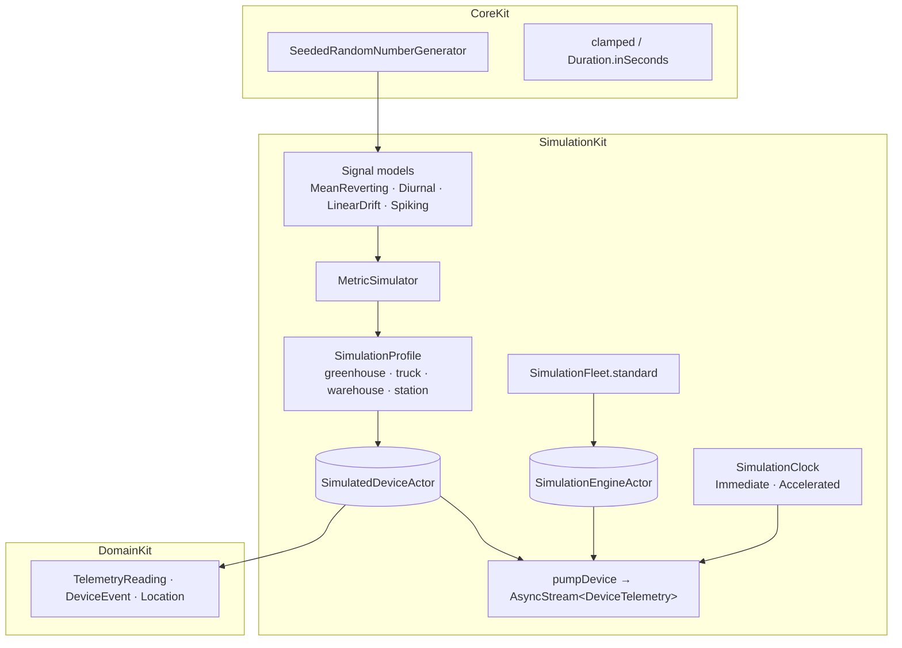
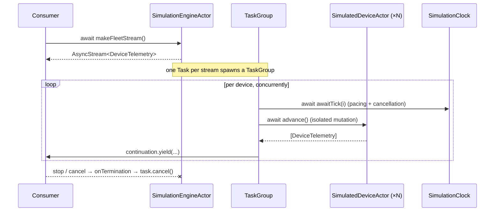

# 15. SimulationKit

`SimulationKit` is SignalFlow's **primary data source during development and testing**. It is not a
"fake data" stub — it is a small simulation engine that produces realistic, gradually-evolving
telemetry for many heterogeneous IoT devices at once, exposed as cancellation-correct `AsyncSequence`s
and reproducible from a seed. Dashboard, Charts, Alerts, and the Foundation Models insights can all be
built entirely on top of it, then swapped for a live gateway behind the same domain types.

```
swift build ✅   swift test → 60 tests, 13 suites ✅   ./Scripts/check-boundaries.sh ✅
```

It depends only on **`DomainKit`** (the telemetry vocabulary it emits) and **`CoreKit`** (the
deterministic RNG and small numeric helpers). No networking, no persistence, no UI.

## 15.1 Architecture



Layering of responsibilities:

| Piece | Responsibility |
| --- | --- |
| `SimulationClock` | Maps tick index → simulated `Date` (pure) and **paces** ticks (cancellation-aware) |
| Signal models | The math that makes a single metric evolve *gradually and plausibly* |
| `MetricSimulator` | One metric: its model, unit, and safe-range breach (rising-edge) detection |
| `SimulationProfile` | A device's whole recipe — metrics + door/connectivity/motion behaviors |
| `SimulatedDeviceActor` | Owns all mutable state; `advance()` emits one tick's telemetry deterministically |
| `pumpDevice` + `AsyncStream` | Turns tick-by-tick advancement into a consumable, cancellation-correct stream |
| `SimulationEngineActor` | Owns a fleet; merges device streams concurrently |
| `SimulationFleet` | Ready-made 10-device, 4-asset-type fleet |

## 15.2 Concurrency strategy

The design follows one rule: **all mutable state lives inside an actor; everything that crosses a
boundary is an immutable `Sendable` value.** There is no lock and no `@unchecked Sendable` anywhere.

- Each `SimulatedDeviceActor` owns its signal state, RNG, tick counter, and the door/connectivity/
  motion state machines. Because `advance()` is actor-isolated, a device's progression is serialized
  and race-free by construction.
- **Devices run genuinely concurrently.** The fleet stream fans out across devices with a
  `TaskGroup`, and the per-device loop (`pumpDevice`) is a *free function*, not an engine method — so
  `await device.advance()` hops to each device's own actor independently instead of serializing on
  the engine. Ten devices simulate in parallel.
- Identity (`id`, `name`, …) is exposed as `nonisolated let`, so the engine can list its fleet
  without awaiting, while the evolving state stays fully isolated.
- The RNG is a **value type**: each device holds its own generator. There is no shared random source
  to contend on, which is both faster and a prerequisite for determinism.

## 15.3 Actor model



Two actors, each justified by ownership:
- **`SimulatedDeviceActor`** owns one device's mutable simulation — the thing that genuinely needs
  isolation.
- **`SimulationEngineActor`** owns the mutable *device registry* (devices can be added at runtime).
  It delegates the hot path to free functions so it never becomes a concurrency bottleneck.

## 15.4 AsyncSequence usage

Telemetry is exposed as `AsyncStream<DeviceTelemetry>`, where `DeviceTelemetry` is an enum of
`DomainKit` values (`reading` / `event` / `location`). Why this shape:

- **Cancellation is structural and correct.** The producing task is cancelled both when the consumer
  stops iterating (`continuation.onTermination`) and when its own task is cancelled — at which point
  `clock.awaitTick` throws and the loop exits. A cancelled stream stops generating *promptly*,
  verified by a test that cancels mid-flight and asserts the task returns.
- **Standard combinators just work** — `for await`, `.prefix(n)`, `.compactMap`, etc., because it's a
  real `AsyncSequence`. Consumers don't learn a bespoke API.
- **Bounded or unbounded.** `maxTicks` gives a stream that finishes on its own (ideal for tests and
  batch generation); `nil` runs until cancelled (ideal for a live dashboard).
- **Many streams at once.** Per-device and merged-fleet streams can run simultaneously without shared
  mutable state.

## 15.5 Deterministic simulation approach

Determinism is a first-class feature, not an accident:

1. **Seeded RNG (SplitMix64).** Same seed ⇒ identical sequence. The fleet derives each device's seed
   from a base seed, so an entire 10-device run is reproducible.
2. **Simulated time is a pure function of the tick index** — `instant(forTick:)` = `origin + tick ×
   index`. Timestamps never come from `Date()`, so the *data* is independent of when or how fast the
   simulation runs. A test asserts two runs with the same seed are byte-for-byte `Equatable`-equal.
3. **Deterministic identity.** Entity ids (`ReadingID`, `EventID`) are derived from the RNG via
   `nextUUID()`, so even identifiers are stable across runs — which is what lets telemetry be compared
   with `==`.
4. **Time is injected, not ambient.** `ImmediateSimulationClock` runs tests instantly; the identical
   simulation under `AcceleratedSimulationClock` plays out in real time for a demo. Neither changes
   the output.

### Why it *feels* realistic
Values evolve through **stateful signal models**, never independent random draws:
- **Mean-reverting walks** (discrete Ornstein–Uhlenbeck) keep temperature/humidity drifting near a
  baseline with small Gaussian shocks — gradual, bounded, plausible.
- **Diurnal** models add a day/night sine cycle for greenhouses and weather stations.
- **Spiking** models give CO₂ occasional decaying spikes.
- **Linear drift** models battery degradation with a recharge cycle.
- **Coupled dynamics**: an open truck door warms the cabin, which then breaches the temperature safe
  range and raises a `threshold_exceeded` event — realistic cause and effect, and exactly the data
  the Alerts feature needs. A test asserts consecutive temperature readings never jump more than a few
  degrees per tick.

## 15.6 Event generation

Beyond readings, devices emit discrete `DeviceEvent`s on a rising edge: `doorOpened` / `doorClosed`,
`disconnected` / `connected` (with the device staying *silent* during an outage), `battery_low`
(latched so it fires once per drain), and `threshold_exceeded` when a metric leaves its safe range.
Moving assets also emit `location` updates as they drift along a heading. Each event type has a
focused, deterministic test using a forced-behavior profile (e.g. `openProbability: 1`).

## 15.7 Why this demonstrates senior-level Swift 6

| Decision | What it signals |
| --- | --- |
| All mutable state behind actors; everything crossing a boundary is `Sendable`; zero `@unchecked` | Fluency with the Swift 6 isolation model, not just `async/await` |
| Free-function pump inside a `TaskGroup` so device actors run in parallel | Understanding that *where* isolation sits determines whether you get concurrency or a bottleneck |
| `nonisolated let` identity + isolated state | Precise control of the isolation boundary |
| Cancellation propagated through `onTermination` + a throwing clock | Correct, leak-free `AsyncSequence` lifecycle management |
| Injected `SimulationClock` (immediate vs. accelerated) | Testable concurrency with no `sleep`, no flakiness |
| Seeded value-type RNG + tick-derived time + derived ids | Reproducible distributed-system simulation |
| Stateful signal models with coupled dynamics | Simulation/systems thinking, not `Double.random()` |
| Output is pure `DomainKit` value types | Clean Architecture — the simulator is swappable for a live source behind the same contracts |

## 15.8 Using it

```swift
// Deterministic, instant (tests / batch):
let clock = ImmediateSimulationClock()
let engine = SimulationFleet.standard(seed: 42, clock: clock, maxTicks: 100)
for await item in await engine.makeFleetStream() { /* reading / event / location */ }

// Real-time demo, accelerated 600× (1 hour of telemetry ≈ 6 seconds):
let liveClock = AcceleratedSimulationClock(timeScale: 600)
let live = SimulationFleet.standard(clock: liveClock)        // runs until cancelled
```

Deferred by design: the `DataKit` repository implementations that adapt these streams to the
`DomainKit` ports (persisting via SwiftData, reducing to snapshots) are a later step — `SimulationKit`
deliberately stops at producing domain telemetry.
