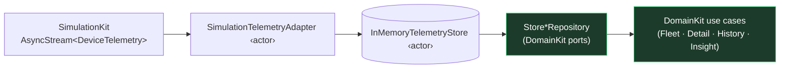

# 16. DataKit

`DataKit` is the layer that **turns a telemetry source into the `DomainKit` repository ports**. Today
that source is `SimulationKit`; tomorrow it will be a real gateway and a SwiftData store. Either way,
features and use cases see only the abstract ports — they never learn where the data came from.

```
swift build ✅   swift test → 82 tests, 18 suites ✅   ./Scripts/check-boundaries.sh ✅
```

It depends only on **`DomainKit`** (the types it returns) and **`SimulationKit`** (the source it
adapts). No SwiftData, no networking, no Foundation Models, no UI.

## 16.1 Responsibility

DataKit answers one question: *how does raw telemetry become the domain snapshots, history, and
alerts that the use cases query?* Concretely it:

- **owns an in-memory store** (`InMemoryTelemetryStore`) — the data-access core;
- **ingests** SimulationKit's `AsyncStream<DeviceTelemetry>` into that store;
- **reconstructs domain entities** (`Device`, `Asset`, …) from accumulated telemetry;
- **manages alert lifecycle** using `DomainKit`'s rule logic;
- **exposes `DomainKit` ports** (`AssetRepository`, `DeviceRepository`, `TelemetryRepository`,
  `AlertRepository`, `InsightsProviding`) as the only public consumption surface.

## 16.2 Why it adapts SimulationKit into the DomainKit ports

The whole architecture rests on the Dependency Rule: features depend on **abstractions** (the ports),
never on a concrete source. DataKit is where the inversion is realized. SimulationKit produces a
stream of `DeviceTelemetry`; the use cases want `try await telemetry.latestReadings(forDevice:)`.
DataKit is the adapter between the two — so:

- the **Dashboard, Charts, Alerts, and Insights** features can be built *now*, entirely on realistic
  data, before any persistence or backend exists;
- when the live gateway and SwiftData arrive, **only DataKit changes** — the ports, use cases, and
  features are untouched. That "swap the source, keep everything else" property is the payoff.

A test (`consumableThroughDomainPortsOnly`) drives the whole layer through a function that names only
`DomainKit` types, proving no SimulationKit concept leaks into the consumption path.



## 16.3 Actor-based store design

`InMemoryTelemetryStore` is an `actor`. **All** mutable state lives inside it — the device catalog,
the latest snapshot per metric, bounded history, events, connectivity, and active alerts — so
concurrent ingestion and reads are race-free by construction, with no lock anywhere.

- The store's record types are **private** and never cross the boundary; queries return only
  `DomainKit` value types (`Asset`, `Device`, `TelemetryReading`, `Alert`).
- A `Device` snapshot is **reconstructed on demand** from accumulated telemetry: metrics from the
  readings seen, battery from the latest `batteryLevel`, connectivity from reading arrival and
  connect/disconnect events, location from the latest position. Status itself is *not* stored — the
  domain `DeviceHealthPolicy` derives it in the use case.
- The `Store*Repository` types are **thin, `Sendable` adapters** that forward port calls to the
  actor. Keeping them logic-free makes the store the single source of truth and keeps the ports
  trivially swappable.

### Alert lifecycle without duplicating domain rules
On each reading the store calls `DomainKit`'s `AlertRule.evaluate` for the **breach decision**, and
only manages the *lifecycle* around it: raise an alert once per breach, dedupe repeated breaches, and
clear it on recovery. Thresholds (which values warrant an alert) are configuration — `DataKit` picks
sensible defaults per asset kind in `DefaultAlertRules`, built from `DomainKit`'s `AlertRule`/
`Threshold`. No rule logic is reimplemented.

## 16.4 AsyncStream ingestion

`SimulationTelemetryAdapter` is the one component that touches the simulation stream. It offers two
ingestion modes:

- **Structured** (`ingestAll`) — `for await item in await engine.makeFleetStream() { await store.ingest(item) }`,
  running under the caller's task. With a bounded clock (`maxTicks`) it completes deterministically,
  which is exactly what tests want.
- **Managed** (`start`/`stop`) — owns a single background `Task`, stored on the actor so it can be
  cancelled. The task closure captures only the two actors (engine, store), **not `self`**, so there
  is no retain cycle.

The `SimulatedDataSource` façade wires the store, fleet, adapter, and repositories together and
exposes only domain ports plus `bootstrap()` / `ingestAll()` / `start()` / `stop()`. It's built via
`deterministic(seed:maxTicks:)` or `live(seed:timeScale:)` factories, so **no caller ever names a
SimulationKit type** — the bridge is fully encapsulated.

## 16.5 Startup & cancellation strategy

Both ends of the background ingestion lifecycle are made **observable and structural**, so tests can
prove behavior with no sleeps and no timing tolerances.

**Startup is observable.** `start()` only *schedules* the loop's `Task` and returns immediately — it
does **not** guarantee any item has been ingested yet. For when that guarantee is needed, the adapter
exposes `startAndWaitUntilFirstIngestion()`, which returns only once the loop has ingested its first
*reading*. It's backed by a one-shot `IngestionReadiness` actor: the loop calls `fire()` after the
first reading lands, and the waiter is resumed via a `CheckedContinuation` — no polling, no sleeps, no
racing the scheduler. (A loop that ends before producing a reading still fires readiness on exit, so a
waiter can never hang.)

**Cancellation is structural, with no task leaks, and `stop()` awaits the loop's completion** rather
than just requesting cancellation:

- `stop()` cancels the stored task and then `await task.value`. Cancelling ends the `for await`
  (AsyncStream is cancellation-aware), which terminates the underlying fleet stream through its
  `onTermination`, cancelling the producing task group all the way down. Because `stop()` awaits the
  loop to finish, **once `stop()` returns no telemetry from the cancelled session can still mutate the
  store.**
- The ingestion loop also checks `Task.isCancelled` **before** each `store.ingest`, so it stops at the
  first safe point rather than draining buffered items.
- `deinit` cancels the task as a backstop, so an abandoned adapter never leaves a stream running.

The test (`stopHaltsIngestion`) is therefore fully deterministic: it
`startAndWaitUntilFirstIngestion()` (proving ingestion is live, `count > 0`), `stop()`s, then reads the
count twice and asserts it's unchanged — because the loop is provably finished, a second read is
identical without waiting.

> **Two CI races we fixed, both structurally.**
> 1. **Writes after stop.** An earlier `stop()` only *requested* cancellation and returned; the
>    unstructured `Task` kept draining for one more accelerated tick on a loaded runner. Making
>    `stop()` await `task.value` made "stopped" a guarantee, not a hope.
> 2. **No writes *before* stop.** `start()` returns before the loop has run, so on a slow CI scheduler
>    the test could `stop()` before a single reading was ingested and see `count == 0`. The fix is a
>    deterministic readiness signal (`startAndWaitUntilFirstIngestion()`), not a longer sleep.
>
> The principle in both: replace "wait a bit and hope" with an explicit synchronization point. No
> sleeps, no tolerances — the invariants hold by construction.

## 16.6 Why persistence and networking are intentionally deferred

DataKit is deliberately **source- and storage-agnostic at this stage**. Persistence (SwiftData) and
networking (a live gateway) are separate concerns that each deserve their own focused step:

- The **in-memory store** already exercises the full shape of the data layer — ingestion, snapshot
  reconstruction, history, alert lifecycle, concurrency — so features can be built on it immediately.
  Adding SwiftData later is an *implementation* of the same store responsibilities behind the same
  ports, not a redesign.
- The **simulated gateway** stands in for networking as a first-class source (see ADR-0003), so the
  app runs end-to-end with zero infrastructure today. A `WebSocketGateway` later conforms to the same
  `TelemetryGateway` seam.

Deferring them keeps this change reviewable and the boundaries honest: each future layer slots into a
seam that already exists rather than forcing a rewrite.

## 16.7 How this demonstrates senior-level iOS architecture

| Decision | Signal |
| --- | --- |
| Adapter realizes Dependency Inversion: source → ports | Understands that the value of Clean Architecture is *swappability*, demonstrated by a test that consumes the layer through domain ports alone |
| All mutable state in one actor; private records; `Sendable` value types out | Fluency with the Swift 6 isolation model — no locks, no `@unchecked` |
| Thin repositories over a store core (DAO + adapters) | Separation of data access from port conformance; one source of truth |
| Domain rules reused for breach decisions; DataKit owns only lifecycle | Disciplined layering — no business-logic duplication |
| Structured + managed ingestion, leak-free cancellation, retain-cycle-free task | Correct, production-grade `AsyncSequence` lifecycle management |
| Persistence/networking deferred behind existing seams | Judgment about sequencing and scope, with a credible path to evolve |

## 16.8 Using it

```swift
// Deterministic (tests / previews):
let source = SimulatedDataSource.deterministic(seed: 42, maxTicks: 120)
try await source.bootstrap()
await source.ingestAll()
let fleet = try await FetchFleetOverviewUseCase(
    assets: source.assets, devices: source.devices, alerts: source.alerts
)()

// Live (running app): real-time ingestion at 600× speed.
let live = SimulatedDataSource.live(seed: 42, timeScale: 600)
try await live.bootstrap()
await live.start()      // … await live.stop() to halt
```
