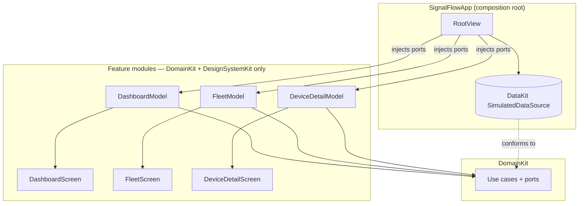

# 17. Feature Layer — Dashboard, Fleet & Device Detail

The first visible experience: a **Dashboard** (monitoring home), a **Fleet** list (search / sort /
filter), and a **Device Detail** screen with Swift Charts. All three are built with modern SwiftUI +
Observation, driven entirely by `DomainKit` ports, and composed against live `DataKit` data at the
app root.

```
swift build ✅   swift test → 93 tests, 21 suites ✅   ./Scripts/check-boundaries.sh ✅
```

## 17.1 Feature architecture

Each feature is a vertical slice with two parts:

- **Presentation models** — immutable `Sendable` value types (`FleetRow`, `FleetStats`, `EventRow`,
  `TrendSeries`, …) that are render-ready projections of domain entities. The views never touch a
  `Device` or `Alert` directly.
- **An `@Observable @MainActor` model** (`FleetModel`, `DashboardModel`, `DeviceDetailModel`) that
  loads data through `DomainKit` use cases/ports and exposes the presentation state.

The dependency rule holds strictly: features import **only `DomainKit` and `DesignSystemKit`** (plus
SwiftUI / Charts / Observation). They cannot name `DataKit` or `SimulationKit` — the boundary check
([Scripts/check-boundaries.sh](../Scripts/check-boundaries.sh)) enforces it. Repositories arrive as
injected `any AssetRepository`, `any TelemetryRepository`, … so a feature is testable with hand-written
fakes and indifferent to whether the data is simulated, persisted, or live.



The composition root is the **only** place that knows DataKit exists: `RootView` builds the
`SimulatedDataSource`, starts ingestion, and injects its ports into the screens. A future `@main App`
just hosts `RootView`.

## 17.2 Observation strategy

- **`@Observable`, never `ObservableObject`; no Combine.** Models are `@Observable` classes, so SwiftUI
  tracks property access at the granularity of individual reads — a view that reads only `searchText`
  re-renders on search changes but not when `rows` reload.
- **`@MainActor` on every model.** UI state mutates on the main actor; repository work hops off it via
  `async`/`await`. No manual thread hops, no `DispatchQueue`.
- **Derived state is computed, not stored.** `FleetModel.visibleRows` filters + searches + sorts on
  read, so it's always consistent with its inputs and there's no cache to invalidate.
- **`@Bindable` for two-way binding.** Screens take `@State private var model` and derive a local
  `@Bindable var model = model` in `body` to bind the search field and pickers — the modern
  Observation idiom that replaces `@ObservedObject`/`$`.
- **Live refresh via structured concurrency.** Each model exposes `observe()` — a cancellation-aware
  loop (`while !Task.isCancelled { await refresh(); try await Task.sleep(...) }`) started from
  `.task`, so it's automatically cancelled when the view disappears. No timers, no subscriptions to
  tear down.

## 17.3 Data flow

```mermaid
sequenceDiagram
    participant V as View (.task)
    participant M as @Observable Model (@MainActor)
    participant UC as DomainKit Use Case
    participant R as Repository port (DataKit impl)

    V->>M: await observe()
    loop until view disappears (cancellation)
        M->>UC: await fetchFleetOverview()
        UC->>R: await allAssets / devices / activeAlerts
        R-->>UC: domain entities
        UC-->>M: [FleetOverview]
        M->>M: map → presentation rows; set phase = .loaded
        M-->>V: Observation re-renders changed views
        M->>M: try await Task.sleep(interval)
    end
```

Mapping always flows **domain → presentation** inside the model. The Dashboard folds the fleet
overview into `FleetStats` (a pure `static` function, unit-tested directly), and resolves event device
names from the same overview.

## 17.4 Swift Charts integration

Device Detail renders temperature, humidity, and battery trends with Swift Charts. The model prepares
chart-ready `TrendSeries` (a metric + unit + `[TrendPoint]`), only including a series when it has ≥2
points — so a truck with no humidity sensor simply shows no humidity chart. The chart itself is
deliberately plain (one `LineMark`, native axes, the metric's semantic tint), matching the
"data, not decoration" brief:

```swift
Chart(series.points) { point in
    LineMark(x: .value("Time", point.date), y: .value(series.metric.displayName, point.value))
        .interpolationMethod(.catmullRom)
        .foregroundStyle(series.metric.lineTint)
}
.chartYAxisLabel(series.unitSymbol)
.frame(height: 160)
```

## 17.5 Design

Apple-native, information-dense, no decorative effects — modeled on Weather / Stocks / Home:

- **DesignSystemKit** owns the product's visual semantics: it maps domain concepts (`DeviceStatus`,
  `AlertSeverity`, `ConnectivityStatus.State`, `AssetKind`, `DeviceEvent.Kind`) to colors, labels, and
  SF Symbols **once**, so "critical" is the same red everywhere and features never invent styling. It
  depends on `DomainKit` for this, but on nothing in the data layer.
- Reusable components (`StatTile`, `StatusBadge`, `CardSection`, `KeyValueRow`, `EventListRow`,
  `BatteryLabel`, …) keep the screens declarative and consistent.
- Native building blocks throughout: `NavigationStack` with value-based `navigationDestination`,
  `.searchable`, `Menu` pickers, `ContentUnavailableView` for empty/error states, `Label`, SF Symbols,
  and hierarchical materials. Everything is cross-platform SwiftUI (no UIKit), so it compiles on the
  macOS host in CI as well as iOS 26.

## 17.6 A required DomainKit addition

The UI needs a "recent events" feed, but `DomainKit` had no events port. I added one **additive**
contract — `EventRepository` (`recentEvents(forDevice:limit:)` and `recentEvents(limit:)`) — and
implemented it in DataKit's store. No existing domain type changed; this is the smallest change that
lets features read events through a domain contract rather than a data-source detail. It's the only
modification outside the feature layer.

## 17.7 Testing

Models are tested two ways (93 tests total, all deterministic, no UI snapshotting):

- **Precise unit tests with fakes.** Hand-written `DomainKit`-port fakes feed crafted fleets, so we
  can assert exact behavior: search matches device *or* asset name, the status filter narrows to one
  status, status-sort surfaces critical first, the dashboard aggregates `total/online/offline/critical`
  exactly and resolves event device names, and a metric with <2 points yields no trend.
- **Integration smoke through DataKit.** Each model is also driven by a real
  `SimulatedDataSource.deterministic(...)` (bootstrap → ingest → refresh), proving the whole path —
  simulation → store → repositories → use cases → presentation — works end-to-end and produces a
  10-device fleet.

Because the models are `@Observable @MainActor` value-mappers over ports, this is all fast and
flake-free — the expensive, flaky kinds of tests (full UI, real network) aren't needed here.

## 17.8 Why this demonstrates modern SwiftUI

| Decision | Signal |
| --- | --- |
| `@Observable` + `@Bindable`, zero `ObservableObject`/Combine | Current Observation model, fine-grained re-rendering |
| `@MainActor` models; `async/await` to repositories | Correct concurrency without `DispatchQueue` or thread hops |
| Computed derived state (`visibleRows`) | No cache invalidation bugs; single source of truth |
| `.task`-driven cancellable refresh loop | Structured concurrency tied to view lifecycle |
| Features see only `DomainKit` ports (enforced) | Clean Architecture that actually holds; fully fakeable |
| Semantics centralized in DesignSystemKit | Consistent, themeable UI; features stay declarative |
| Swift Charts with prepared value-type series | Charts as data, not decoration; testable chart prep |
| Native components (`ContentUnavailableView`, `.searchable`, `NavigationStack`) | Idiomatic, accessible, Apple-HIG UI |
