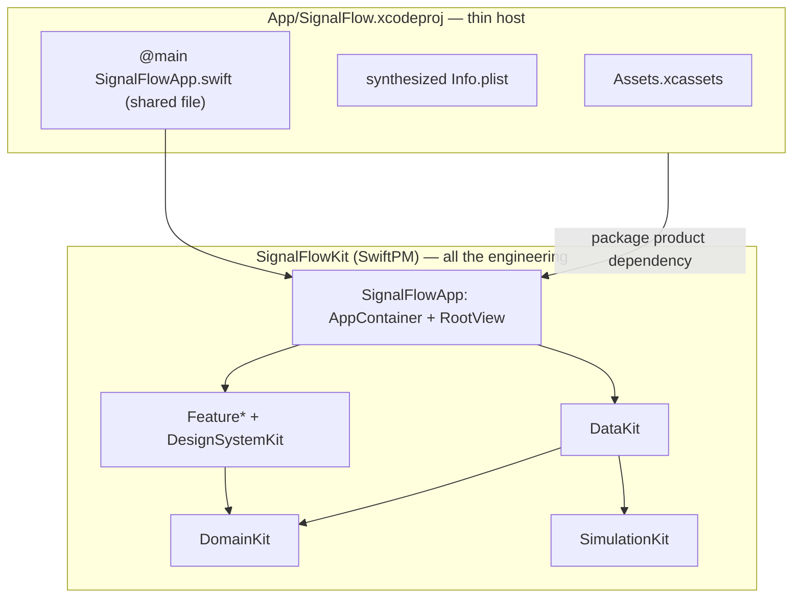

# 19. Xcode iOS App Target

SignalFlow now runs as a real iOS app on the simulator and device, via a **thin** Xcode app target
that hosts the SwiftPM composition root. The project lives at
[`App/SignalFlow.xcodeproj`](../App/SignalFlow.xcodeproj); everything it builds comes from the
package.

```
swift build ✅   swift test → 96 tests ✅   ./Scripts/check-boundaries.sh ✅
xcodebuild -scheme SignalFlow -sdk iphonesimulator … → ** BUILD SUCCEEDED ** ✅
```

## 19.1 Why the Xcode target is intentionally thin

SwiftPM cannot emit an iOS `.app` bundle — only an Xcode app target can. But the *app* is not the
interesting part; the architecture is. So the Xcode target carries the absolute minimum and the
package keeps everything else:

The app target contains only:
- **the asset catalog** ([`App/SignalFlow/Assets.xcassets`](../App/SignalFlow/Assets.xcassets)) with
  a placeholder `AppIcon`;
- **a synthesized `Info.plist`** — `GENERATE_INFOPLIST_FILE = YES` plus a few `INFOPLIST_KEY_*` build
  settings, so there's no plist file to drift;
- **the package product dependency** on `SignalFlowApp`;
- **no Swift source of its own.** It compiles the *same* `@main` file the SwiftPM host runner uses
  (`Sources/SignalFlowHost/SignalFlowApp.swift`), referenced into the target. There is exactly one
  `@main`, shared by both build front-ends — **no duplicated composition, no duplicated entry point.**

That `@main` is ~20 lines (`AppContainer.live()` → `RootView` + scene-phase lifecycle). All real
wiring is in the `SignalFlowApp` library's `AppContainer`/`RootView`.



## 19.2 What remains in SwiftPM

**Everything except the bundle.** Domain logic, simulation, the data layer, every feature, the design
system, the composition root (`AppContainer`), and the navigation (`RootView`) are SwiftPM targets —
built and tested by `swift build` / `swift test`, and guarded by `./Scripts/check-boundaries.sh`. The
Xcode project adds no logic and is not where bugs hide.

This split is the point: the app could be re-hosted (a different shell, a Mac target, a UI-test host)
without moving a line of logic, and the package remains usable, testable, and reviewable on its own.

| Concern | Lives in |
| --- | --- |
| Business logic, data, features, composition, navigation | SwiftPM package (`Sources/…`) |
| `@main` entry point | `Sources/SignalFlowHost/SignalFlowApp.swift` (shared with the Xcode target) |
| Bundle, icon, Info.plist, signing, simulator/device run | Xcode app target (`App/`) |

> **Two host front-ends, one entry file.** `SignalFlowHost` (a SwiftPM `executableTarget`) lets
> `swift build`/`swift run SignalFlowHost` compile and launch the entry from the CLI — keeping the
> `@main` inside the fast SwiftPM CI loop. The Xcode app target compiles the same file into a real
> `.app`. Renaming the runner to `SignalFlowHost` keeps the iOS app's `SignalFlow` scheme unambiguous.

## 19.3 How to run the app in Xcode

```bash
open App/SignalFlow.xcodeproj
```

Then select the **SignalFlow** scheme and an iOS Simulator, and Run (⌘R). The app launches into the
Dashboard/Fleet tabs with live simulated telemetry; tap a device to push Device Detail.

From the command line (what CI runs):

```bash
xcodebuild build \
  -project App/SignalFlow.xcodeproj \
  -scheme SignalFlow \
  -sdk iphonesimulator \
  -destination 'generic/platform=iOS Simulator' \
  CODE_SIGNING_ALLOWED=NO
```

A **shared scheme** (`App/SignalFlow.xcodeproj/xcshareddata/xcschemes/SignalFlow.xcscheme`) is
committed so CI, screenshots, and teammates all use the same build/test/launch configuration.

## 19.4 CI

The GitHub Actions workflow gains a second job, `ios-app`, that runs the `xcodebuild` command above on
a `macos-26` runner. It runs **alongside** the existing SwiftPM `verify` job (build + test + boundary
check) — the package CI is unchanged, so nothing that already passed can regress. Signing is disabled
for the simulator build, so no certificates are needed.

## 19.5 How this prepares screenshots / TestFlight / Fastlane

The thin target is deliberately the seam those tools plug into later:

- **Screenshots** — a committed shared scheme + a buildable simulator app is exactly what
  `xcodebuild ... test` with a UI-test plan (or Fastlane `snapshot`) needs. Adding a UI-test target
  later is additive.
- **TestFlight / App Store** — the bundle identifier, versioning (`MARKETING_VERSION`,
  `CURRENT_PROJECT_VERSION`), and `GENERATE_INFOPLIST_FILE` settings are already in place; archiving
  needs only a real signing identity and an `AppIcon`.
- **Fastlane** — still intentionally deferred (see
  [docs/14](14-git-workflow-and-ci.md#fastlane--intentionally-deferred)). It now has a destination to
  target: `gym` would build this scheme, `snapshot` would drive it, `pilot` would upload the archive.
  Fastlane lands when there's a signing identity and a release to ship — not before.

## 19.6 Constraints honored

No business logic moved out of the package; no app composition duplicated (one shared `@main`); no
CocoaPods/Carthage/third-party dependencies; no UIKit; and no SwiftData, networking, or Foundation
Models introduced. The Xcode target links one thing — the `SignalFlowApp` package product — and
everything else flows from there.
