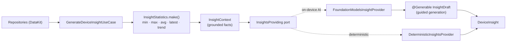
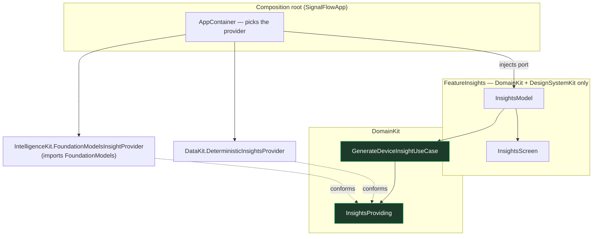

# 20. Foundation Models Insights

SignalFlow's first real on-device AI feature: an **Insights** screen that uses Apple's Foundation
Models to turn recent telemetry into a plain-language summary, an anomaly hypothesis, and an
operational recommendation — with a deterministic fallback and a clear privacy story.

```
swift build ✅   swift test → 105 tests, 25 suites ✅   ./Scripts/check-boundaries.sh ✅
xcodebuild -scheme SignalFlow -sdk iphonesimulator … → ** BUILD SUCCEEDED ** ✅
```

## 20.1 Why Foundation Models

Numbers are easy for a machine and hard for a human at a glance. A grower looking at "humidity 78%,
min 61, max 81, average 70, rising over 240 readings" has to *interpret* it. Foundation Models turn
that into one honest sentence — on-device, with no backend, no API keys, and no data leaving the
phone. It's the right tool precisely where language beats a chart: explaining a multi-hour trend and
hypothesizing a cause.

The framework also fits the project's constraints exactly: it's **first-party** (zero third-party
deps), runs **offline**, and supports **guided generation**, so we get typed output without
`JSONSerialization` or fragile prompt-parsing.

## 20.2 What remains deterministic (the safety boundary)

AI **enhances** the insight system; it never touches safety logic. The hard line:

| Concern | Decided by | AI involvement |
| --- | --- | --- |
| Alert raised / cleared | `DomainKit.AlertRule.evaluate` (thresholds) | **none** |
| Device status (nominal/warning/critical/offline) | `DomainKit.DeviceHealthPolicy` | **none** |
| Trend direction, min/max/avg | `DomainKit.InsightStatistics` (pure Swift) | **none** |
| Active-alert / event **counts** | data layer (already evaluated) | **none** — passed in as facts |
| Wording of summary / anomaly / recommendation | Foundation model | phrasing only |
| Advisory insight "severity" (nominal/watch/concern) | model classification | **advisory only**, not safety |

The model is never asked "is this device in breach?" — thresholds are evaluated deterministically and
the model only ever sees the *resulting count*. `InsightSeverity` is deliberately a separate type from
`AlertSeverity`/`DeviceStatus` so a reviewer can see at a glance that it carries no safety weight.

## 20.3 Grounding strategy — "facts in Swift, words in the model"

Every number an insight is built from is computed in Swift and handed to the provider; the model
phrases, it never produces, values.



1. `GenerateDeviceInsightUseCase` (DomainKit) gathers grounded facts — device name, asset kind, the
   metric's `InsightStatistics`, and **counts** of active alerts and recent events — into an
   `InsightContext`.
2. The provider builds a constrained prompt from those facts and uses **guided generation**
   (`@Generable` / `@Guide`) so the model returns a typed `InsightDraft`, not free text. No
   `JSONSerialization`, no string parsing.
3. The instructions are explicit: *use only the provided facts, never invent numbers, frame anomalies
   as hypotheses, do not give safety verdicts.*
4. `confidence` is derived from sample count in Swift — not asked of the model.

## 20.4 Availability & fallback strategy

Apple Intelligence isn't on every device or simulator. Degradation is graceful and layered:

- **Composition root decides** (`AppContainer.live()`): if `SystemLanguageModel.default.isAvailable`,
  it injects `FoundationModelsInsightProvider` (with the deterministic provider as its runtime
  fallback); otherwise it injects the deterministic provider directly. Both conform to the same
  `InsightsProviding` port, so nothing downstream changes.
- **Provider self-guards at call time**: even when wired, `FoundationModelsInsightProvider` re-checks
  availability and catches any model error, delegating to the deterministic fallback. So an
  availability change or a transient failure never breaks the feature.
- **The UI is honest**: every `DeviceInsight` carries a `source` (`.foundationModel` /
  `.deterministic`). The Insights screen shows a banner — *"Generated on-device by Apple Intelligence"*
  or *"On-device AI is unavailable — showing a deterministic insight instead."*

Availability is an **injectable closure** on the provider, so tests force the unavailable path
deterministically and **CI stays green on machines without Apple Intelligence** — no test ever invokes
the real model.

## 20.5 Privacy model

- **On-device only.** Insights run through Apple's on-device system model. There is no networking in
  the project and no external API is called — telemetry never leaves the device for AI processing.
- **No egress, no keys, no accounts.** The grounded facts are assembled and consumed locally; nothing
  is logged off-device.
- **Surfaced to the user.** The provenance banner states that telemetry stays on the device, so the
  privacy property is visible, not just implied.

## 20.6 Architecture & boundaries



- **`FeatureInsights`** depends only on `DomainKit` + `DesignSystemKit`. It never imports
  `FoundationModels`, `IntelligenceKit`, or `DataKit` — enforced by `check-boundaries.sh` (Rule 2).
- **`IntelligenceKit`** is the *only* target that imports `FoundationModels`; it depends on `DomainKit`
  alone (Rule 5). The deterministic provider stays in `DataKit`.
- The `InsightsProviding` **port** is the seam: deterministic and AI providers are interchangeable
  behind it, and the composition root chooses.

## 20.7 Why this demonstrates senior-level iOS design

| Decision | Signal |
| --- | --- |
| AI phrases facts; Swift computes them | Understands LLM grounding; refuses to let a model invent operational numbers |
| Safety logic stays deterministic; advisory severity is a separate type | Knows *where not to use AI* — the strongest signal of all |
| Guided generation (`@Generable`) instead of JSON parsing | Uses the framework's type-safe path; no fragile string handling |
| One `InsightsProviding` port, provider chosen at the composition root | Dependency Inversion that makes AI swappable and testable |
| `FoundationModels` isolated to one target, enforced by CI | Clean Architecture that actually holds |
| Injectable availability → deterministic tests, green CI without Apple Intelligence | Testable AI integration, not a demo that only runs on the author's device |
| Provenance + on-device privacy surfaced in the UI | Apple platform privacy principles applied and made visible |

## 20.8 Using it

```swift
// Composition root picks the provider based on availability:
let deterministic = DeterministicInsightsProvider()
let insights: any InsightsProviding = FoundationModelsInsightProvider.systemModelAvailable
    ? FoundationModelsInsightProvider(fallback: deterministic)
    : deterministic

// Features only ever see the port:
let insight = try await GenerateDeviceInsightUseCase(
    devices: devices, assets: assets, telemetry: telemetry,
    alerts: alerts, events: events, insights: insights
)(deviceID: deviceID, metric: .temperature, range: range)
// insight.source tells the UI whether the model or the fallback produced it.
```

In the app, the **Insights** tab lets you pick a device and metric and shows the result with its
provenance banner.
