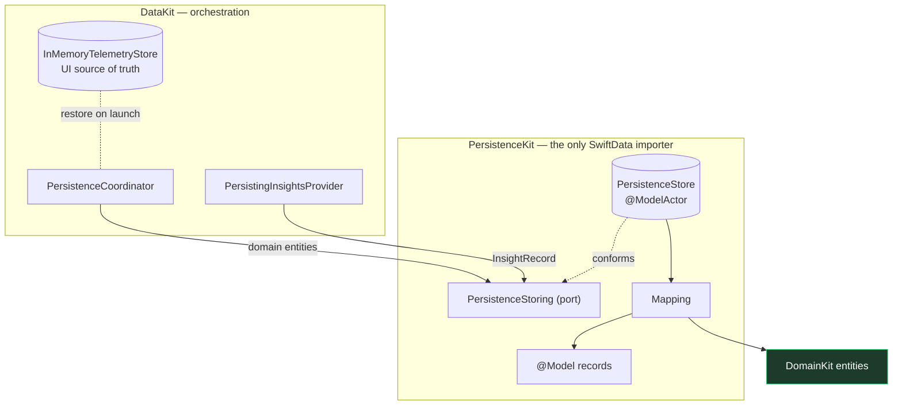

# 21. SwiftData Persistence

`PersistenceKit` makes SignalFlow **offline-first and durable**: assets, devices, telemetry history,
events, alerts, and insight history survive relaunch, restored instantly on startup while the
simulation continues on top. It is the **only** module that imports SwiftData.

```
swift build ✅   swift test → 117 tests, 28 suites ✅   ./Scripts/check-boundaries.sh ✅
xcodebuild -scheme SignalFlow -sdk iphonesimulator … → ** BUILD SUCCEEDED ** ✅
```

## 21.1 Why SwiftData

- **First-party, zero dependencies** — consistent with the project's no-third-party rule.
- **Swift 6 native concurrency** — SwiftData's `ModelActor` gives a first-class way to do all storage
  work off the main actor with compiler-enforced isolation, which is exactly the model this project
  is built to demonstrate.
- **Migration-friendly** — the schema is all primitives (domain enums encoded as strings), so future
  `VersionedSchema`/`SchemaMigrationPlan` steps stay simple.

## 21.2 Architecture & boundaries



- **`DomainKit` never knows SwiftData exists.** PersistenceKit depends on DomainKit alone; `@Model`
  records are `internal` and never leave the actor. Every method on the port speaks `DomainKit` value
  types, mapped at the boundary by `Mapping`.
- **`DataKit` remains the orchestration layer.** It owns the in-memory store (the UI's fast read
  source) and a `PersistenceCoordinator` that mirrors writes to storage; it talks to PersistenceKit
  through the `PersistenceStoring` **port**, never SwiftData.
- **Feature modules are unchanged** — they still consume only `DomainKit` ports.
- The boundary check enforces both new rules: **only `PersistenceKit` may import `SwiftData`**, and
  `PersistenceKit` may import **`DomainKit` only**.

## 21.3 Why a dedicated ModelActor

`PersistenceStore` is a **`@ModelActor`**. That decision carries weight:

- **No persistence on the main actor.** The `@ModelActor` macro gives the store its own `ModelContext`
  on a dedicated executor. All fetches, inserts, saves, and pruning run off-main, so a burst of
  telemetry never blocks the UI.
- **Race-free by construction.** Actor isolation serializes concurrent access with no locks and no
  `@unchecked Sendable`. A test fires 200 concurrent appends and asserts nothing is lost.
- **`@Model` objects never escape.** They're reference types and not `Sendable`; confining them to the
  actor and returning only `DomainKit` value types is what keeps Swift 6 strict concurrency happy and
  the architecture clean.

## 21.4 Offline-first strategy

The in-memory store stays the UI's source of truth (fast, synchronous reads via the repositories);
SwiftData is the durable backing.

- **On launch** (`SimulatedDataSource.bootstrap()`): register the simulated catalog, then restore the
  last persisted **snapshot** — last-known device state, the *latest* reading per metric, active
  alerts, recent events, and recent insights — into the in-memory store. The fleet is therefore shown
  with real data the instant the app opens, before any new telemetry arrives.
- **While running:** the `PersistenceCoordinator` buffers high-volume readings/events and flushes them
  in batches off the hot path; each flush also snapshots low-volume device state and active alerts. A
  periodic flush keeps storage fresh; a final flush on stop loses nothing.
- **Insights** are captured by a `PersistingInsightsProvider` decorator — every generated insight is
  recorded in memory and persisted, transparently wrapping either the Foundation Models or
  deterministic provider.

Because the simulation is fully deterministic (seeded RNG + **seed-derived, stable device/asset IDs**)
and persistence is keyed on stable ids, restore lines up exactly and re-ingestion is **idempotent** —
relaunching reproduces the same dataset rather than duplicating it. Restore loads the *latest*
snapshot for instant display; the full history is kept durably for retention and future use, and the
charts rehydrate from the continuing simulation.

## 21.5 Retention strategy

Storage is bounded regardless of how long the app runs. Caps (in `RetentionPolicy`, enforced on flush):

| Data | Policy | Rationale |
| --- | --- | --- |
| Telemetry readings | most recent **2,000 per device-and-metric** | The high-volume table; a per-series rolling window keeps charts useful while bounding total rows (~10 devices × ~3 metrics). |
| Device events | most recent **1,000 per device** | Bounded, low volume. |
| Insights | most recent **200 per device** | A useful history without growth. |
| Active alerts | **active-only**, replaced per device | Captures raise/clear/acknowledge; naturally tiny. |

Pruning uses a `FetchDescriptor` with `fetchOffset = cap` sorted newest-first, deleting everything past
the cap — touching only the series written in the batch. A test caps a series at 10, appends 25, and
asserts exactly the 10 most recent survive.

## 21.6 Concurrency model

- Swift 6 strict concurrency throughout; **no `@unchecked Sendable`**, no actor violations, no
  main-actor persistence.
- `PersistenceStore` (ModelActor) owns all SwiftData state; `PersistenceCoordinator` (actor) owns the
  write buffers; the in-memory store (actor) owns the read model. Everything crossing a boundary is a
  `Sendable` `DomainKit` value type.
- The coordinator's background flush task captures only Sendable values and is cancelled on stop, then
  performs a final flush — the same leak-free, cancellation-safe pattern as the ingestion adapter.

## 21.7 Testing

12 deterministic tests, all using an **in-memory** `ModelContainer` (no disk, no flakiness):

- **Model mapping** — every entity round-trips domain → record → domain, including custom metric/event
  kinds and alert acknowledgement state.
- **Persistence round-trip** — written entities come back through `loadSnapshot`; idempotent re-append.
- **Actor isolation** — 200 concurrent appends, serialized, nothing lost.
- **Restoration** — a second data source over the same store restores the fleet, latest telemetry, and
  last-known connectivity end-to-end; insight history survives.
- **Retention** — a capped series prunes to the most recent N.

CI stays deterministic: in-memory storage, stable seed-derived ids, no wall-clock dependence.

## 21.8 What is intentionally **not** persisted

UI state (selected device, search text, sort/filter, navigation) is **not** persisted — it belongs to
the presentation layer and SwiftUI restores it where appropriate. Persistence is for *facts*: the
fleet, its telemetry, and what was alerted/observed/inferred.
