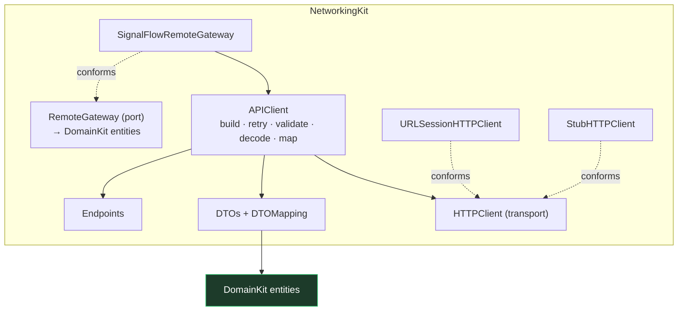

# 22. NetworkingKit

`NetworkingKit` is SignalFlow's remote HTTP layer: a production-shaped `URLSession` + `async/await`
client with strongly-typed endpoints, DTO mapping, structured errors, and a small retry policy — all
driven by an injected transport, so it runs and is fully tested **with no backend**. It's the only
module that does remote HTTP.

```
swift build ✅   swift test → 142 tests, 33 suites ✅   ./Scripts/check-boundaries.sh ✅
xcodebuild -scheme SignalFlow -sdk iphonesimulator … → ** BUILD SUCCEEDED ** ✅
```

It imports **DomainKit + Foundation only** — no third-party libraries, no Combine, no
`JSONSerialization`, no UIKit/SwiftUI/SwiftData/FoundationModels.

## 22.1 Networking architecture

Two layers with one job each, plus a gateway that speaks domain types:



- **`HTTPClient`** — the thin transport seam: `data(for: URLRequest) -> (Data, HTTPURLResponse)`. No
  validation, no decoding. `URLSessionHTTPClient` is production; `StubHTTPClient` is the deterministic
  in-process stand-in.
- **`APIClient`** — the engine: builds the request from an endpoint, performs it through the transport
  with retry, validates the status, decodes the body, and maps every failure to `NetworkError`.
- **`RemoteGateway`** — the domain-facing port. `SignalFlowRemoteGateway` implements it on top of
  `APIClient` and returns **`DomainKit` entities**, so DataKit never sees DTOs or HTTP.

## 22.2 Endpoint design

Endpoints are strongly typed via a phantom `Response`:

```swift
public protocol Endpoint: Sendable {
    associatedtype Response: Decodable & Sendable
    var path: String { get }
    var method: HTTPMethod { get }     // default .get
    var queryItems: [URLQueryItem] { get }
    var headers: [String: String] { get }
    var body: Data? { get }
}
```

So `client.send(AssetsEndpoint())` infers `[AssetDTO]` at the call site — no stringly-typed plumbing.
`RequestBuilder` turns an endpoint + base URL into a `URLRequest` (path joining, query items, default
+ per-endpoint headers, auto `Content-Type` when there's a body). The defined endpoints cover assets,
devices (per asset + single), telemetry (latest + ranged history with `metric`/`from`/`to` query),
events, alerts, and an acknowledge write.

## 22.3 DTO mapping

`DTOs` are the **only** place JSON shapes live. `DTOMapping` translates them to validated `DomainKit`
entities, so **DomainKit never knows DTOs exist**. Mapping is throwing — a malformed payload (a bad
UUID, an out-of-range value) is rejected at the boundary rather than corrupting the domain. Enum keys
(metric, event kind, severity, …) use stable strings; the network's wire format is owned here,
independent of the persistence schema.

## 22.4 Error handling

One structured, `Equatable` error surfaces from the layer:

```swift
public enum NetworkError: Error, Sendable, Equatable {
    case invalidURL, nonHTTPResponse
    case unacceptableStatusCode(Int)
    case decoding(String)
    case transport(code: Int)   // URLError code, so retry can reason about it
    case cancelled
    case unknown(String)
}
```

`NetworkError.map` normalizes `URLError` (incl. `.cancelled`), `CancellationError`, and `DecodingError`
into these cases. Status validation happens in the client (2xx only); decoding failures are wrapped,
never silently swallowed.

## 22.5 Retry strategy

`RetryPolicy` (configurable `maxAttempts`, exponential backoff from `baseDelay`) retries **only safe,
transient failures**:

- ✅ transport errors, `408`, `429`, `5xx`
- ❌ cancellation, decoding errors, other `4xx`, invalid URL

It is **cancellation-aware** (`Task.checkCancellation` each attempt; cancellation is never retried)
and the backoff delay is applied by an **injected sleeper** (`@Sendable (Duration) async throws ->
Void`). Production sleeps via `Task.sleep`; tests inject a no-op sleeper, so retry tests assert the
exact number of attempts with **no real waiting** and zero flakiness.

## 22.6 Mock / stub transport

`StubHTTPClient` is an `actor` (no `@unchecked Sendable`) that returns a **scripted sequence of
outcomes** (`.success(Data, status:)` / `.transportError(URLError)`, repeating the last once
exhausted) and records every request. It powers tests for successful responses, decoding failures,
invalid status codes, transport errors, and retry counts — all deterministic, all backend-free. The
same stub can run the app against canned data if ever needed.

## 22.7 DataKit integration & why it's behind abstractions

DataKit gains a **`RemoteDataSource`** that exposes the *same* `DomainKit` ports as
`SimulatedDataSource`, but reads from a `RemoteGateway`. Its repositories delegate to the gateway
(which already returns domain entities), so:

- **DataKit orchestration is unchanged**, and features still depend only on the ports.
- The remote layer is **kept behind the `RemoteGateway` and `HTTPClient` abstractions** — DataKit
  names neither URLs nor `URLSession`, only the gateway; the transport is injected. That's what makes
  it testable with a stub and swappable for a real `URLSession` with no code change.

### Why the app still defaults to SimulationKit

`RemoteDataSource` is **built and tested but not wired into the running app** — `AppContainer.live()`
still uses `SimulatedDataSource`. There is no real backend yet, so defaulting to remote would mean a
non-functional app and non-deterministic CI. Keeping SimulationKit as the default means the app runs
end-to-end on a fresh checkout, while the networking layer is proven and ready. Switching is a
one-line change at the composition root when a backend exists:

```swift
// Future: AppContainer.live() could build a remote source instead of a simulated one.
let source = RemoteDataSource(baseURL: apiBaseURL, transport: URLSessionHTTPClient())
```

### How this prepares future backend integration

Everything a real backend needs is in place and proven: typed endpoints, DTO mapping, status/error
handling, retry, and a gateway that already returns domain entities. Adding the backend is wiring
(`URLSessionHTTPClient` + a base URL + auth headers) plus filling in any endpoints — not a redesign.
Writes (acknowledgement) and read paths are demonstrated; auth, pagination, and caching are natural
next steps behind the same seams.

## 22.8 Boundaries

Enforced by `check-boundaries.sh`:
- **NetworkingKit** may import DomainKit + Foundation only — never UI, SwiftData, another data module,
  IntelligenceKit, or features (Rule 8).
- **Feature modules** may not import NetworkingKit (Rule 2).
- Only DataKit (orchestration) and the composition root link NetworkingKit.

## 22.9 Testing

25 deterministic tests, no backend: request construction; response decoding; status validation;
transport-error mapping; DTO → Domain mapping (incl. custom metric keys and invalid-UUID rejection);
retry (succeeds after transient failures, exhausts attempts, never retries decoding/4xx);
cancellation; remote-gateway behavior (paths, query items, acknowledge POST, server errors); and the
DataKit `RemoteDataSource` serving mapped entities through the ports.
